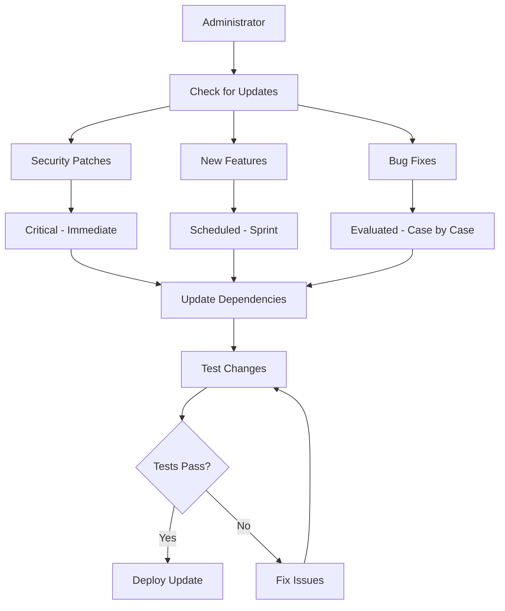
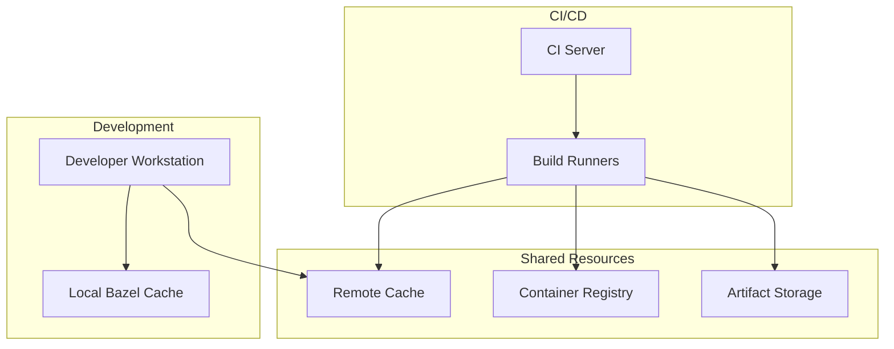
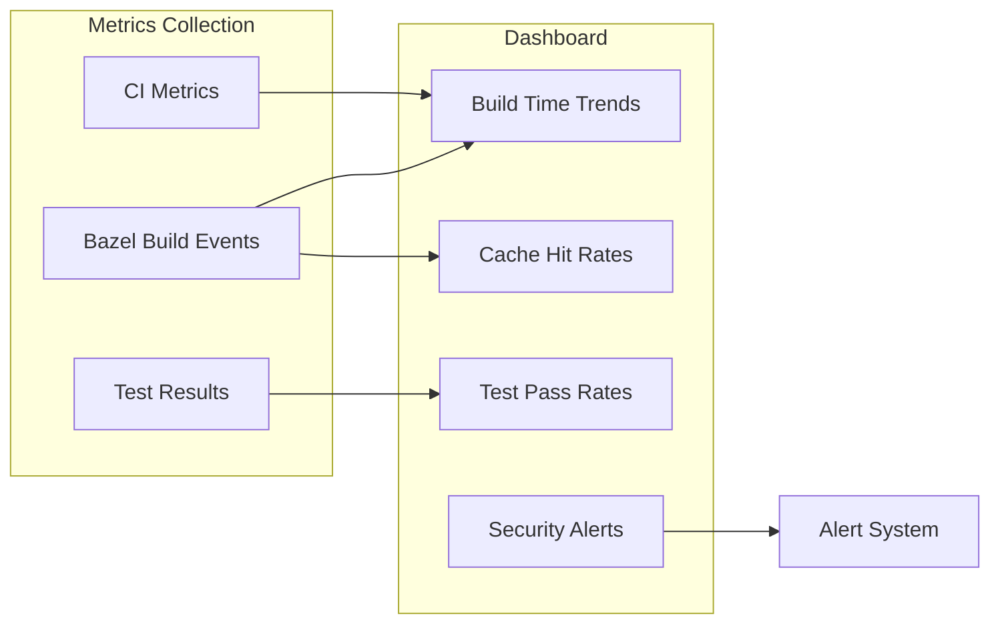
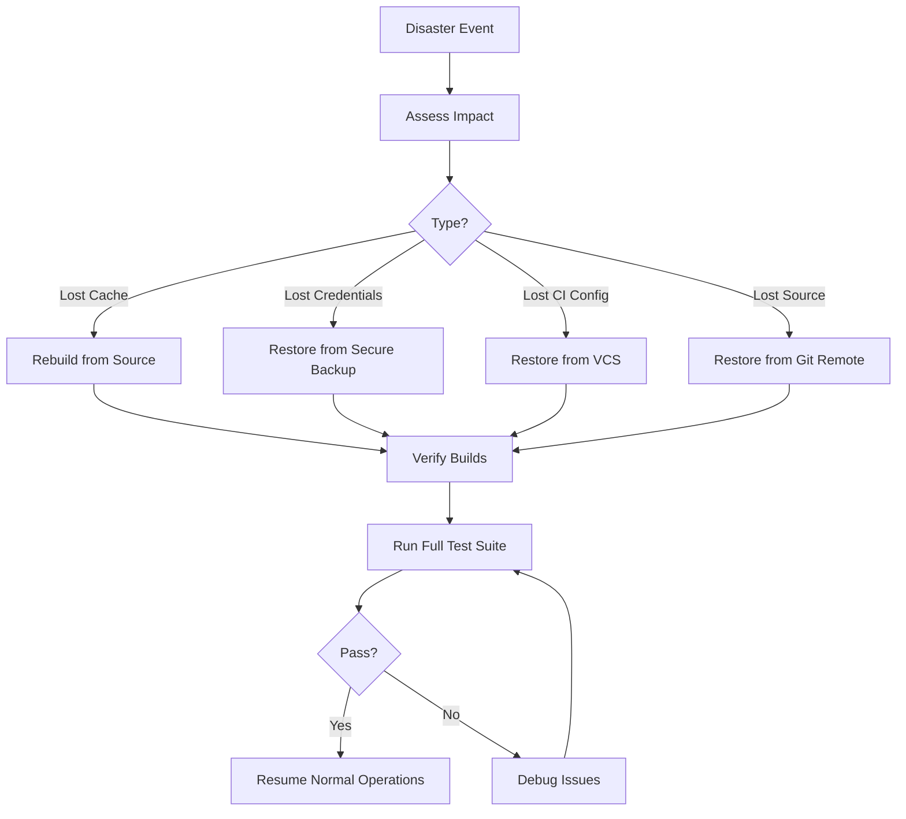
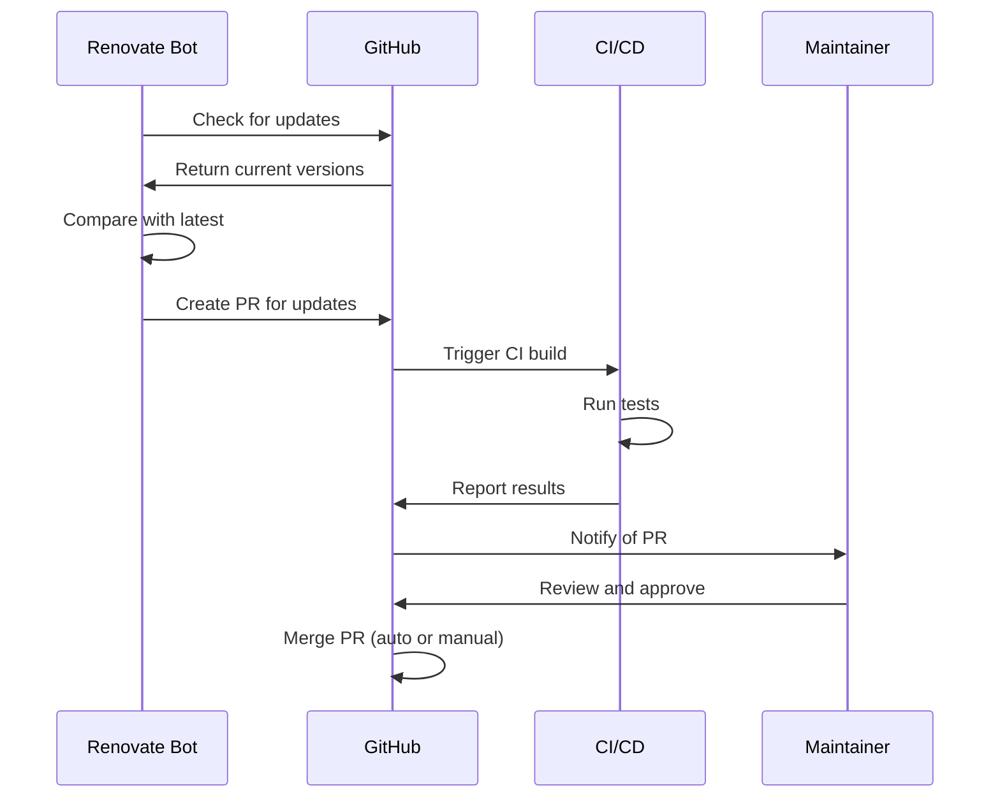
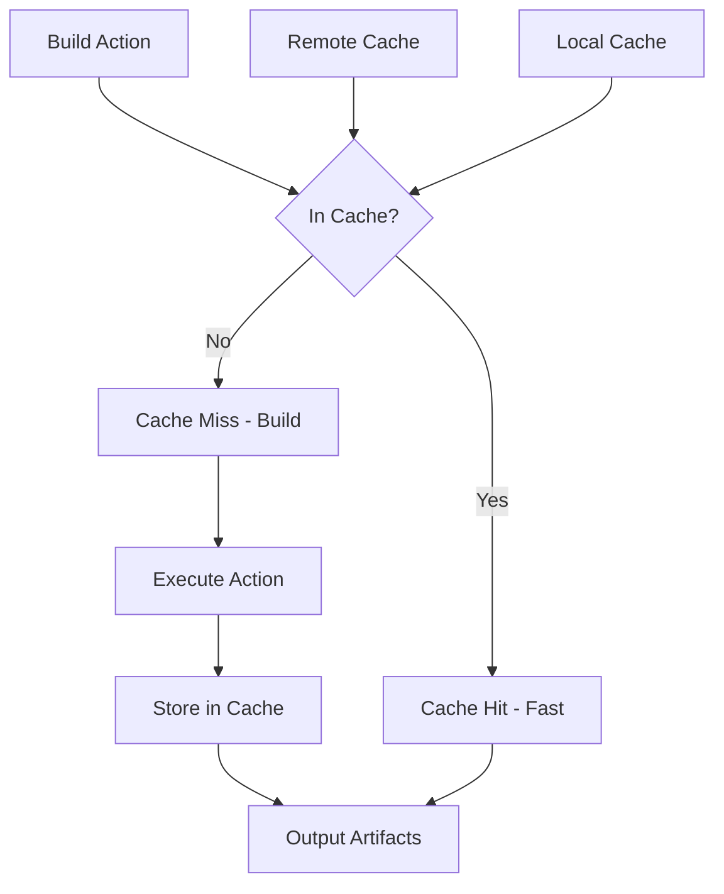
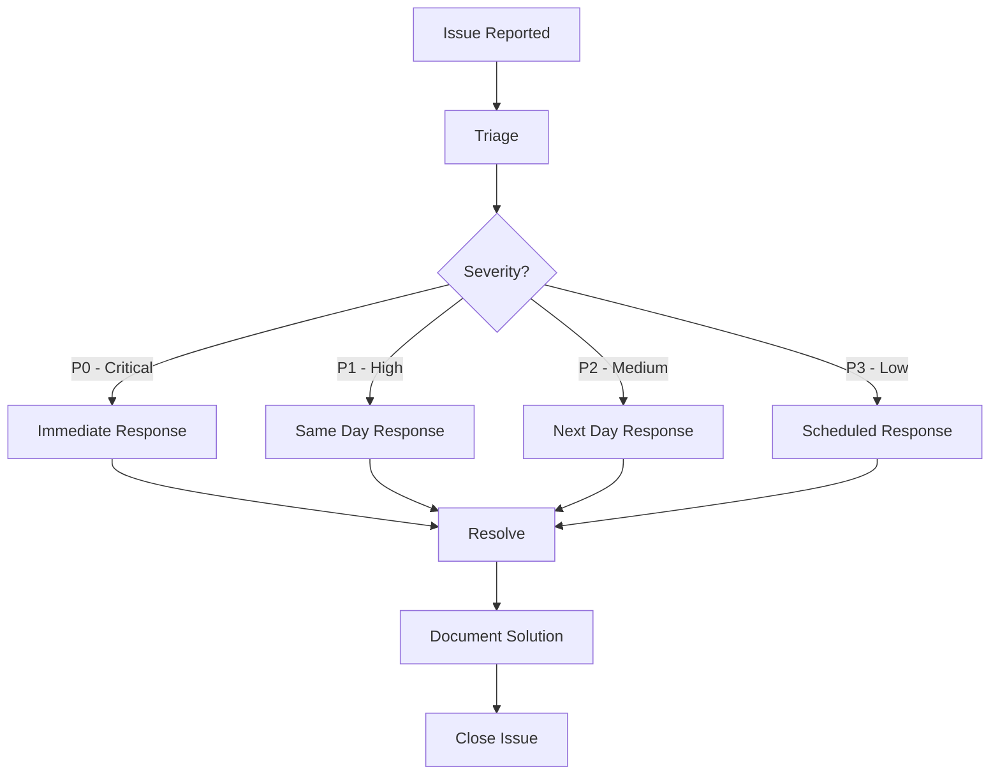

# Administrator Guide

Welcome to the Aspect Workflows Template Administrator Guide! This guide is for maintainers, DevOps engineers, and administrators who manage and maintain projects based on this template.

## Table of Contents

1. [Maintenance Overview](./maintenance.md) - Regular maintenance tasks
2. [Dependency Management](./dependency-management.md) - Updating dependencies
3. [CI/CD Configuration](./ci-cd.md) - Continuous integration setup
4. [Release Management](./release-management.md) - Version and release processes
5. [Security](./security.md) - Security best practices
6. [Troubleshooting](./troubleshooting.md) - Common administrative issues
7. [Monitoring](./monitoring.md) - Build and performance monitoring

## Overview

As an administrator of projects using the Aspect Workflows Template, you're responsible for:

- Keeping dependencies up to date
- Managing CI/CD pipelines
- Ensuring build reproducibility
- Monitoring build performance
- Handling security updates
- Managing tool versions
- Supporting development teams

## Quick Reference

### Common Administrative Tasks

```bash
# Update all dependencies
./tools/repin

# Update Bazel dependencies
bazel mod tidy

# Update npm dependencies
pnpm update

# Update Go dependencies
go mod tidy

# Test entire project
aspect test //...

# Check for outdated dependencies
bazel query @maven//:outdated  # Java
pnpm outdated                  # JavaScript
```

## Key Responsibilities

### 1. Dependency Management

Maintain secure, up-to-date dependencies across all languages:



### 2. Build System Maintenance

Keep the Bazel build system healthy:

- Monitor build times
- Optimize slow builds
- Manage remote cache
- Update Bazel versions
- Review and update .bazelrc configurations

### 3. CI/CD Pipeline Management

Ensure reliable continuous integration:

- Configure build pipelines
- Set up test automation
- Manage secrets and credentials
- Configure deployment processes
- Monitor pipeline health

### 4. Security Management

Maintain security posture:

- Monitor security advisories
- Apply security patches promptly
- Conduct security audits
- Manage access controls
- Review dependency vulnerabilities

## Infrastructure Components

### Build Infrastructure



### Recommended Infrastructure

1. **Remote Build Cache**
   - Google Cloud Storage
   - AWS S3
   - Azure Blob Storage
   - Self-hosted cache server

2. **Container Registry**
   - Docker Hub
   - Google Artifact Registry
   - AWS ECR
   - GitHub Container Registry

3. **CI/CD Platform**
   - GitHub Actions
   - GitLab CI
   - CircleCI
   - Jenkins

## Maintenance Schedule

### Daily Tasks

- ✅ Monitor CI/CD pipeline status
- ✅ Review failed builds
- ✅ Check security alerts

### Weekly Tasks

- ✅ Review dependency updates (Renovate PRs)
- ✅ Check build performance metrics
- ✅ Review and merge approved PRs
- ✅ Update documentation as needed

### Monthly Tasks

- ✅ Update Bazel version (if new release)
- ✅ Review and update toolchain versions
- ✅ Audit security vulnerabilities
- ✅ Review cache hit rates
- ✅ Performance optimization review

### Quarterly Tasks

- ✅ Major dependency upgrades
- ✅ Review and update CI/CD configuration
- ✅ Security audit
- ✅ Disaster recovery testing
- ✅ Documentation review and updates

## Monitoring and Metrics

### Key Metrics to Track

1. **Build Performance**
   - Build time trends
   - Cache hit rates
   - Test execution time
   - Network bandwidth usage

2. **CI/CD Health**
   - Pipeline success rate
   - Average build duration
   - Queue times
   - Resource utilization

3. **Dependency Health**
   - Outdated dependencies count
   - Security vulnerabilities
   - License compliance
   - Update frequency

4. **Developer Experience**
   - Time to first build
   - Build failure rate
   - Setup documentation effectiveness
   - Support ticket trends

### Monitoring Dashboard Example



## Backup and Disaster Recovery

### What to Back Up

1. **Source Code**: Already in Git
2. **Build Cache**: Can be rebuilt (optional backup)
3. **Credentials and Secrets**: Secure backup required
4. **CI/CD Configuration**: Version controlled
5. **Documentation**: Version controlled

### Recovery Procedures



## Automated Dependency Updates

### Renovate Configuration

The template includes `renovate.json` for automated dependency updates:

```json
{
  "$schema": "https://docs.renovatebot.com/renovate-schema.json",
  "extends": [
    "config:recommended",
    ":automergeMinor"
  ]
}
```

**Configuration Options:**

- Auto-merge minor updates
- Group related updates
- Schedule updates
- Custom PR descriptions

### Dependency Update Flow



## Tool Version Management

### Multitool Lockfile

Tools are managed via `tools/tools.lock.json`:

```json
{
  "gazelle": {
    "version": "0.45.0",
    "checksums": {...}
  }
}
```

**Updating Tools:**

1. Edit `tools/BUILD` to reference new version
2. Run `bazel run @multitool//:update_lock`
3. Test with the new version
4. Commit the updated lockfile

## Performance Optimization

### Build Performance Tuning

1. **Enable Remote Caching**

   ```bash
   # Add to .bazelrc
   build --remote_cache=https://your-cache-server
   ```

2. **Optimize Memory Usage**

   ```bash
   # Add to .bazelrc
   build --jobs=auto
   build --local_ram_resources=HOST_RAM*.8
   ```

3. **Profile Builds**

   ```bash
   bazel build --profile=profile.json //...
   bazel analyze-profile profile.json
   ```

4. **Use Build Event Protocol**

   ```bash
   bazel build --build_event_json_file=bep.json //...
   ```

### Cache Optimization



## Security Best Practices

### 1. Dependency Security

- Enable Renovate security updates
- Use `bazel mod graph` to audit dependencies
- Scan container images for vulnerabilities
- Keep toolchains updated

### 2. Credential Management

- Never commit secrets to version control
- Use CI/CD secret management
- Rotate credentials regularly
- Use service accounts for automation

### 3. Access Control

- Implement least privilege access
- Review access permissions quarterly
- Use branch protection rules
- Require code reviews for sensitive changes

## Support and Escalation

### Support Tiers



### Escalation Path

1. **Level 1**: Development team
2. **Level 2**: Build system administrators
3. **Level 3**: Template maintainers
4. **Level 4**: Aspect Build support (enterprise customers)

## Resources

### Documentation

- [Bazel Documentation](https://bazel.build/)
- [Aspect CLI Docs](https://docs.aspect.build/)
- [rules_lint](https://github.com/aspect-build/rules_lint)
- [Renovate Docs](https://docs.renovatebot.com/)

### Community

- **Bazel Slack**: #aspect-build channel
- **GitHub Issues**: Report bugs and feature requests
- **GitHub Discussions**: Ask questions and share knowledge

### Training

- Aspect Build workshops
- Bazel training courses
- Internal knowledge sharing sessions

---

**Next**: [Maintenance Overview](./maintenance.md) | **Up**: [Documentation Home](../README.md)
