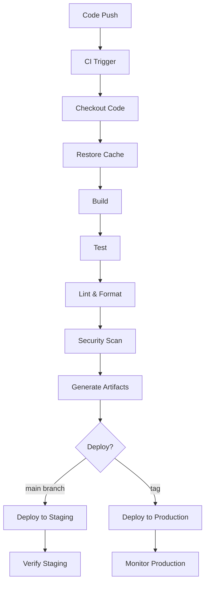

# CI/CD Configuration

This guide covers configuring continuous integration and deployment for projects using the Aspect Workflows Template.

## Table of Contents

1. [Overview](#overview)
2. [GitHub Actions Setup](#github-actions-setup)
3. [GitLab CI Setup](#gitlab-ci-setup)
4. [CircleCI Setup](#circleci-setup)
5. [Build Optimization](#build-optimization)
6. [Deployment Pipelines](#deployment-pipelines)
7. [Best Practices](#best-practices)

## Overview

CI/CD for Bazel projects requires:

- Bazel caching configuration
- Test execution
- Build artifact generation
- Deployment automation
- Monitoring and alerts

### CI/CD Architecture



## GitHub Actions Setup

### Basic Workflow

```yaml
# .github/workflows/ci.yml
name: CI

on:
  push:
    branches: [main]
  pull_request:
    branches: [main]

permissions:
  contents: read
  pull-requests: write

jobs:
  build-and-test:
    runs-on: ubuntu-latest
    
    steps:
      - name: Checkout code
        uses: actions/checkout@v4
      
      - name: Mount bazel cache
        uses: actions/cache@v3
        with:
          path: |
            ~/.cache/bazel
            ~/.cache/bazelisk
          key: bazel-${{ runner.os }}-${{ hashFiles('.bazelversion', 'MODULE.bazel', 'WORKSPACE') }}
          restore-keys: |
            bazel-${{ runner.os }}-
      
      - name: Install Bazel
        uses: bazel-contrib/setup-bazel@0.8.0
        with:
          bazelisk-cache: true
          disk-cache: ${{ github.workflow }}
          repository-cache: true
      
      - name: Build
        run: bazel build //...
      
      - name: Test
        run: bazel test //...
      
      - name: Upload test results
        if: always()
        uses: actions/upload-artifact@v3
        with:
          name: test-results
          path: bazel-testlogs/**/test.xml
```

### Multi-Platform Build

```yaml
# .github/workflows/multi-platform.yml
name: Multi-Platform Build

on:
  push:
    branches: [main]
  pull_request:

jobs:
  build:
    strategy:
      matrix:
        os: [ubuntu-latest, macos-latest, windows-latest]
        
    runs-on: ${{ matrix.os }}
    
    steps:
      - uses: actions/checkout@v4
      
      - name: Setup Bazel
        uses: bazel-contrib/setup-bazel@0.8.0
      
      - name: Build
        run: bazel build //...
        
      - name: Test
        run: bazel test //...
```

### With Remote Caching

```yaml
# .github/workflows/ci-remote-cache.yml
name: CI with Remote Cache

on:
  push:
    branches: [main]
  pull_request:

jobs:
  build-test:
    runs-on: ubuntu-latest
    
    steps:
      - uses: actions/checkout@v4
      
      - name: Authenticate to Google Cloud
        uses: google-github-actions/auth@v2
        with:
          credentials_json: ${{ secrets.GCP_CREDENTIALS }}
      
      - name: Setup Bazel
        uses: bazel-contrib/setup-bazel@0.8.0
      
      - name: Build with remote cache
        run: |
          bazel build //... \
            --remote_cache=https://storage.googleapis.com/my-bazel-cache \
            --remote_upload_local_results=true \
            --google_default_credentials
      
      - name: Test with remote cache
        run: |
          bazel test //... \
            --remote_cache=https://storage.googleapis.com/my-bazel-cache \
            --google_default_credentials
```

### Code Quality Checks

```yaml
# .github/workflows/quality.yml
name: Code Quality

on:
  pull_request:

jobs:
  format:
    runs-on: ubuntu-latest
    steps:
      - uses: actions/checkout@v4
      
      - name: Setup environment
        run: |
          sudo apt-get update
          sudo apt-get install -y direnv
          direnv allow
      
      - name: Check formatting
        run: |
          bazel run //tools:bazel_env
          format --check
  
  lint:
    runs-on: ubuntu-latest
    steps:
      - uses: actions/checkout@v4
      
      - name: Setup Bazel
        uses: bazel-contrib/setup-bazel@0.8.0
      
      - name: Run linters
        run: aspect lint //...
```

### Security Scanning

```yaml
# .github/workflows/security.yml
name: Security

on:
  schedule:
    - cron: '0 0 * * *'
  push:
    branches: [main]

jobs:
  dependency-scan:
    runs-on: ubuntu-latest
    steps:
      - uses: actions/checkout@v4
      
      - name: Python security audit
        run: pip-audit requirements/all.txt
      
      - name: JavaScript security audit
        run: pnpm audit --audit-level=moderate
      
      - name: Go security audit
        uses: securego/gosec@master
        with:
          args: ./...
  
  container-scan:
    runs-on: ubuntu-latest
    if: ${{ hashFiles('Dockerfile') }}
    steps:
      - uses: actions/checkout@v4
      
      - name: Build image
        run: bazel build //path/to:image
      
      - name: Scan image
        uses: aquasecurity/trivy-action@master
        with:
          image-ref: bazel/path/to:image
          format: 'sarif'
          output: 'trivy-results.sarif'
      
      - name: Upload results
        uses: github/codeql-action/upload-sarif@v2
        with:
          sarif_file: 'trivy-results.sarif'
```

### Release Workflow

```yaml
# .github/workflows/release.yml
name: Release

on:
  push:
    tags:
      - 'v*'

jobs:
  release:
    runs-on: ubuntu-latest
    permissions:
      contents: write
      packages: write
    
    steps:
      - uses: actions/checkout@v4
        with:
          fetch-depth: 0
      
      - name: Setup Bazel
        uses: bazel-contrib/setup-bazel@0.8.0
      
      - name: Build release artifacts
        run: |
          bazel build --config=release //...
      
      - name: Run tests
        run: bazel test --config=release //...
      
      - name: Build container images
        if: ${{ env.OCI_ENABLED == 'true' }}
        run: bazel build //path/to:image
      
      - name: Push container images
        if: ${{ env.OCI_ENABLED == 'true' }}
        run: bazel run //path/to:image.push
      
      - name: Create GitHub Release
        uses: softprops/action-gh-release@v1
        with:
          files: |
            bazel-bin/**/*.tar.gz
            bazel-bin/**/*.zip
          generate_release_notes: true
```

## GitLab CI Setup

### Basic Pipeline

```yaml
# .gitlab-ci.yml
variables:
  BAZEL_VERSION: "7.0.0"

stages:
  - build
  - test
  - deploy

cache:
  paths:
    - .cache/bazel

before_script:
  - apt-get update && apt-get install -y curl
  - curl -L https://github.com/bazelbuild/bazelisk/releases/latest/download/bazelisk-linux-amd64 -o /usr/local/bin/bazel
  - chmod +x /usr/local/bin/bazel

build:
  stage: build
  script:
    - bazel build //...
  artifacts:
    paths:
      - bazel-bin/
    expire_in: 1 hour

test:
  stage: test
  script:
    - bazel test //...
  artifacts:
    reports:
      junit: bazel-testlogs/**/test.xml

lint:
  stage: test
  script:
    - bazel run //tools:bazel_env
    - format --check
    - aspect lint //...

deploy:staging:
  stage: deploy
  script:
    - bazel build --config=release //...
    - ./scripts/deploy.sh staging
  only:
    - main
  environment:
    name: staging
    url: https://staging.example.com

deploy:production:
  stage: deploy
  script:
    - bazel build --config=release //...
    - ./scripts/deploy.sh production
  only:
    - tags
  environment:
    name: production
    url: https://example.com
  when: manual
```

### With Remote Cache

```yaml
# .gitlab-ci.yml
variables:
  BAZEL_REMOTE_CACHE: "https://cache.example.com"
  BAZEL_REMOTE_CACHE_KEY: "${CI_JOB_TOKEN}"

.bazel_job:
  before_script:
    - echo "build --remote_cache=${BAZEL_REMOTE_CACHE}" >> .bazelrc.user
    - echo "build --remote_upload_local_results=true" >> .bazelrc.user

build:
  extends: .bazel_job
  stage: build
  script:
    - bazel build //...
```

## CircleCI Setup

### Configuration

```yaml
# .circleci/config.yml
version: 2.1

orbs:
  bazel: circleci/bazel@1.0.0

workflows:
  build-test-deploy:
    jobs:
      - build-and-test
      - deploy:
          requires:
            - build-and-test
          filters:
            branches:
              only: main

jobs:
  build-and-test:
    docker:
      - image: cimg/base:stable
    
    resource_class: large
    
    steps:
      - checkout
      
      - bazel/install:
          version: "7.0.0"
      
      - restore_cache:
          keys:
            - bazel-{{ checksum ".bazelversion" }}-{{ checksum "MODULE.bazel" }}
            - bazel-{{ checksum ".bazelversion" }}-
            - bazel-
      
      - run:
          name: Build
          command: bazel build //...
      
      - run:
          name: Test
          command: bazel test //...
      
      - save_cache:
          key: bazel-{{ checksum ".bazelversion" }}-{{ checksum "MODULE.bazel" }}
          paths:
            - ~/.cache/bazel
      
      - store_test_results:
          path: bazel-testlogs
      
      - store_artifacts:
          path: bazel-bin
  
  deploy:
    docker:
      - image: cimg/base:stable
    
    steps:
      - checkout
      
      - bazel/install
      
      - run:
          name: Build release
          command: bazel build --config=release //...
      
      - run:
          name: Deploy
          command: ./scripts/deploy.sh
```

## Build Optimization

### Caching Strategy

**Layer caching:**

```yaml
# GitHub Actions
- name: Cache Bazel
  uses: actions/cache@v3
  with:
    path: |
      ~/.cache/bazel
      ~/.cache/bazelisk
    key: ${{ runner.os }}-bazel-${{ hashFiles('**/BUILD', '**/MODULE.bazel') }}
    restore-keys: |
      ${{ runner.os }}-bazel-
```

**Remote caching configuration:**

```bash
# .bazelrc
build --remote_cache=https://storage.googleapis.com/my-cache
build --remote_upload_local_results=true
build --remote_timeout=3600

# Only upload from CI
build:ci --remote_upload_local_results=true

# Local development doesn't upload
build --remote_upload_local_results=false
```

### Parallel Execution

```yaml
# GitHub Actions - matrix builds
strategy:
  matrix:
    target:
      - //src/app/...
      - //src/lib/...
      - //src/tools/...
  
runs-on: ubuntu-latest

steps:
  - uses: actions/checkout@v4
  - name: Build
    run: bazel build ${{ matrix.target }}
```

### Build Without Testing

```yaml
# Separate build and test jobs
jobs:
  build:
    runs-on: ubuntu-latest
    steps:
      - run: bazel build //...
  
  test:
    needs: build
    runs-on: ubuntu-latest
    strategy:
      matrix:
        shard: [0, 1, 2, 3]
    steps:
      - run: |
          bazel test //... \
            --test_shard_count=4 \
            --test_shard_index=${{ matrix.shard }}
```

## Deployment Pipelines

### Kubernetes Deployment

```yaml
# .github/workflows/deploy-k8s.yml
name: Deploy to Kubernetes

on:
  push:
    branches: [main]
    tags: ['v*']

jobs:
  deploy:
    runs-on: ubuntu-latest
    steps:
      - uses: actions/checkout@v4
      
      - name: Build container
        run: bazel build //app:image
      
      - name: Push to registry
        run: bazel run //app:image.push
      
      - name: Setup kubectl
        uses: azure/setup-kubectl@v3
      
      - name: Deploy to k8s
        run: |
          kubectl set image deployment/myapp \
            app=gcr.io/myproject/app:${GITHUB_SHA}
          kubectl rollout status deployment/myapp
```

### Cloud Run Deployment

```yaml
# .github/workflows/deploy-cloudrun.yml
name: Deploy to Cloud Run

on:
  push:
    branches: [main]

jobs:
  deploy:
    runs-on: ubuntu-latest
    steps:
      - uses: actions/checkout@v4
      
      - uses: google-github-actions/auth@v2
        with:
          credentials_json: ${{ secrets.GCP_SA_KEY }}
      
      - name: Build and push
        run: |
          bazel run //app:image.push \
            --embed_label=version=${GITHUB_SHA:0:7}
      
      - name: Deploy to Cloud Run
        run: |
          gcloud run deploy myapp \
            --image=gcr.io/myproject/app:${GITHUB_SHA} \
            --region=us-central1 \
            --platform=managed
```

### AWS ECS Deployment

```yaml
# .github/workflows/deploy-ecs.yml
name: Deploy to ECS

on:
  push:
    branches: [main]

jobs:
  deploy:
    runs-on: ubuntu-latest
    steps:
      - uses: actions/checkout@v4
      
      - name: Configure AWS credentials
        uses: aws-actions/configure-aws-credentials@v4
        with:
          aws-access-key-id: ${{ secrets.AWS_ACCESS_KEY_ID }}
          aws-secret-access-key: ${{ secrets.AWS_SECRET_ACCESS_KEY }}
          aws-region: us-east-1
      
      - name: Login to ECR
        run: |
          aws ecr get-login-password | \
            docker login --username AWS --password-stdin \
            ${{ secrets.ECR_REGISTRY }}
      
      - name: Build and push
        run: bazel run //app:image.push
      
      - name: Deploy to ECS
        uses: aws-actions/amazon-ecs-deploy-task-definition@v1
        with:
          task-definition: task-definition.json
          service: myapp
          cluster: production
```

## Best Practices

### Configuration Management

**Use config files:**

```bash
# .bazelrc.ci
build --config=ci
build --remote_cache=https://cache.example.com
build --jobs=auto
build --verbose_failures
build --show_timestamps
build --announce_rc
build --remote_timeout=3600
```

**Load in CI:**

```yaml
- name: Build
  run: bazel --bazelrc=.bazelrc.ci build //...
```

### Secrets Management

```yaml
# GitHub Actions
- name: Setup secrets
  run: |
    echo "${{ secrets.DEPLOY_KEY }}" > deploy_key
    chmod 600 deploy_key

# Use secret in Bazel
- name: Deploy
  run: |
    bazel run //deploy \
      --//config:deploy_key=deploy_key
  env:
    SECRET_VALUE: ${{ secrets.SECRET_VALUE }}
```

### Monitoring and Alerts

```yaml
# .github/workflows/ci.yml
jobs:
  build:
    steps:
      # ... build steps ...
      
      - name: Notify on failure
        if: failure()
        uses: 8398a7/action-slack@v3
        with:
          status: ${{ job.status }}
          text: 'Build failed on ${{ github.ref }}'
          webhook_url: ${{ secrets.SLACK_WEBHOOK }}
```

### Build Metrics

```yaml
- name: Generate build profile
  run: bazel build --profile=profile.json //...

- name: Analyze performance
  run: |
    bazel analyze-profile profile.json > analysis.txt
    cat analysis.txt

- name: Upload metrics
  uses: actions/upload-artifact@v3
  with:
    name: build-profile
    path: profile.json
```

### DO

- ✅ Use remote caching for speed
- ✅ Run tests in parallel
- ✅ Cache dependencies between runs
- ✅ Use build profiles to identify bottlenecks
- ✅ Separate build and test stages
- ✅ Monitor build times
- ✅ Alert on failures

### DON'T

- ❌ Run full builds on every commit
- ❌ Skip testing before deploy
- ❌ Hard-code secrets in workflows
- ❌ Ignore build warnings
- ❌ Deploy from local machines
- ❌ Skip security scans

## Troubleshooting

### Slow CI Builds

```bash
# Profile the build
bazel build --profile=profile.json //...

# Find slow actions
bazel analyze-profile profile.json | grep "Total time"

# Check cache hit rate
bazel build --explain=explain.txt //...
grep "cache hit" explain.txt | wc -l
```

### Cache Misses

```bash
# Check remote cache connection
curl -I https://your-cache-server

# Verify authentication
gcloud auth list

# Check cache stats
bazel build --execution_log_json_file=exec.json //...
jq '.[] | select(.remoteCacheHit == true)' exec.json | wc -l
```

### Flaky Tests in CI

```yaml
# Add retry logic
- name: Test with retries
  uses: nick-invision/retry@v2
  with:
    timeout_minutes: 10
    max_attempts: 3
    command: bazel test //...
```

## Next Steps

- Configure [Release Management](./release-management.md)
- Set up [Monitoring](./monitoring.md) dashboards
- Review [Security](./security.md) best practices

---

**Back**: [Dependency Management](./dependency-management.md) | **Next**: [Release Management](./release-management.md)
