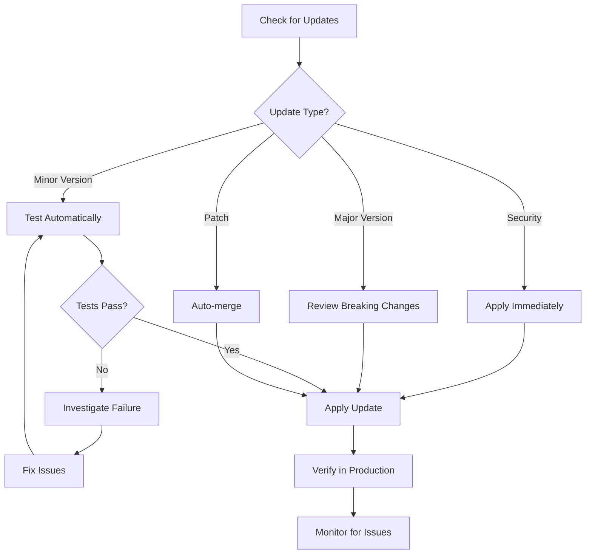
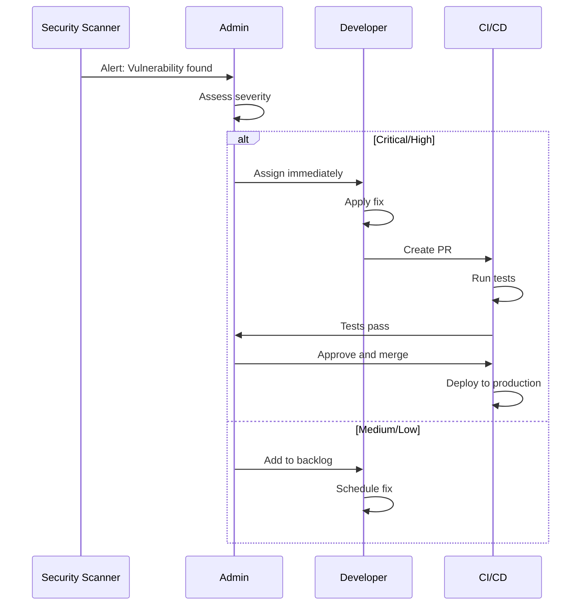
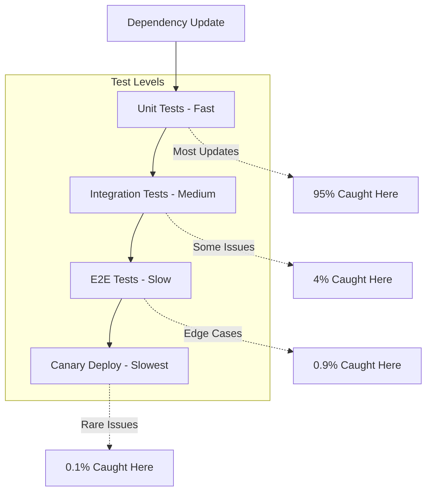

# Dependency Management

This guide covers administrative aspects of managing dependencies across projects using the Aspect Workflows Template.

## Table of Contents

1. [Overview](#overview)
2. [Automated Updates with Renovate](#automated-updates-with-renovate)
3. [Manual Updates](#manual-updates)
4. [Security Management](#security-management)
5. [Version Pinning Strategy](#version-pinning-strategy)
6. [Conflict Resolution](#conflict-resolution)
7. [Best Practices](#best-practices)

## Overview

Effective dependency management balances:

- **Security**: Keeping dependencies updated with security patches
- **Stability**: Avoiding breaking changes
- **Features**: Gaining access to new capabilities
- **Maintenance**: Minimizing update overhead

### Dependency Flow



## Automated Updates with Renovate

### Renovate Configuration

The template includes `renovate.json` in the root:

```json
{
  "$schema": "https://docs.renovatebot.com/renovate-schema.json",
  "extends": [
    "config:recommended"
  ],
  "timezone": "America/New_York",
  "schedule": [
    "after 9am and before 5pm every weekday"
  ],
  "packageRules": [
    {
      "matchUpdateTypes": ["patch", "pin", "digest"],
      "automerge": true
    },
    {
      "matchPackagePatterns": ["*"],
      "matchUpdateTypes": ["minor"],
      "groupName": "all minor dependencies",
      "groupSlug": "all-minor"
    },
    {
      "matchPackagePatterns": ["*"],
      "matchUpdateTypes": ["major"],
      "groupName": "all major dependencies",
      "groupSlug": "all-major"
    }
  ],
  "vulnerabilityAlerts": {
    "labels": ["security"],
    "assignees": ["@security-team"]
  }
}
```

### Customizing Renovate

**Group by ecosystem:**

```json
{
  "packageRules": [
    {
      "matchManagers": ["npm"],
      "groupName": "JavaScript dependencies"
    },
    {
      "matchManagers": ["pip_requirements"],
      "groupName": "Python dependencies"
    },
    {
      "matchManagers": ["gomod"],
      "groupName": "Go dependencies"
    }
  ]
}
```

**Schedule by day:**

```json
{
  "packageRules": [
    {
      "matchUpdateTypes": ["minor", "patch"],
      "schedule": ["before 3am on Monday"]
    },
    {
      "matchUpdateTypes": ["major"],
      "schedule": ["before 3am on the first day of the month"]
    }
  ]
}
```

**Auto-merge configuration:**

```json
{
  "packageRules": [
    {
      "matchUpdateTypes": ["patch"],
      "matchCurrentVersion": "!/^0/",
      "automerge": true,
      "automergeType": "pr",
      "automergeStrategy": "squash",
      "platformAutomerge": true
    }
  ]
}
```

### Managing Renovate PRs

**Daily workflow:**

```bash
# List Renovate PRs
gh pr list --author "renovate[bot]"

# View specific PR
gh pr view 123

# Check CI status
gh pr checks 123

# Merge if passing
gh pr merge 123 --squash --auto

# Or merge multiple
gh pr list --author "renovate[bot]" --json number --jq '.[].number' | \
  xargs -I {} gh pr merge {} --squash --auto
```

**Review checklist:**

- [ ] CI builds passing
- [ ] Tests passing
- [ ] No breaking changes in changelog
- [ ] Security vulnerabilities resolved
- [ ] Compatible with current codebase

## Manual Updates

### Python Dependencies

**Update workflow:**

```bash
# 1. Edit pyproject.toml
vim pyproject.toml

# Update version constraint
[project]
dependencies = [
    "requests>=2.31.0",  # Update from 2.28.0
]

# 2. Update lockfiles
./tools/repin

# 3. Update BUILD files
bazel run gazelle

# 4. Test
bazel test //...

# 5. Commit
git add pyproject.toml requirements/ gazelle_python.yaml
git commit -m "deps: update requests to 2.31.0"
```

**Verify changes:**

```bash
# Check locked version
grep "requests==" requirements/all.txt

# Check dependencies of requests
pip-compile --dry-run requirements/all.in | grep requests -A 5
```

### JavaScript Dependencies

**Update workflow:**

```bash
# 1. Update specific package
pnpm update lodash

# Or update all
pnpm update

# Or update to latest (may include majors)
pnpm update --latest

# 2. Review changes
git diff pnpm-lock.yaml

# 3. Test
bazel test //...

# 4. Commit
git add package.json pnpm-lock.yaml
git commit -m "deps: update lodash to 4.17.21"
```

**Check for outdated:**

```bash
# List outdated packages
pnpm outdated

# Output example:
# Package  Current  Wanted  Latest
# lodash   4.17.20  4.17.21 4.17.21
# react    18.2.0   18.2.0  18.3.0
```

### Go Dependencies

**Update workflow:**

```bash
# 1. Update specific module
go get github.com/spf13/cobra@latest

# Or update all
go get -u ./...

# 2. Tidy go.mod
go mod tidy

# 3. Update Bazel MODULE
bazel mod tidy

# 4. Update BUILD files
bazel run gazelle

# 5. Test
bazel test //...

# 6. Commit
git add go.mod go.sum MODULE.bazel
git commit -m "deps: update cobra to v1.8.0"
```

### Java/Kotlin Dependencies

**Update workflow:**

```bash
# 1. Edit MODULE.bazel
vim MODULE.bazel

# Update version
maven.install(
    artifacts = [
        "com.google.guava:guava:32.1.3-jre",  # Update from 32.0.0
    ],
)

# 2. Update lockfile
bazel run @unpinned_maven//:pin

# 3. Test
bazel test //...

# 4. Commit
git add MODULE.bazel maven_install.json
git commit -m "deps: update guava to 32.1.3"
```

## Security Management

### Security Scanning

**Automated scanning in CI:**

```yaml
# .github/workflows/security.yml
name: Security Scan

on:
  schedule:
    - cron: '0 0 * * *'  # Daily
  push:
    branches: [main]

jobs:
  scan:
    runs-on: ubuntu-latest
    steps:
      - uses: actions/checkout@v3
      
      - name: Python security scan
        run: pip-audit requirements/all.txt
      
      - name: JavaScript security scan
        run: pnpm audit --audit-level=moderate
      
      - name: Go security scan
        uses: securego/gosec@master
      
      - name: Container scan
        if: ${{ hashFiles('Dockerfile') }}
        run: |
          docker build -t app:latest .
          trivy image app:latest
```

### Vulnerability Response

**Severity levels and response times:**

| Severity | Response Time | Action |
|----------|---------------|--------|
| Critical | Immediate (0-4 hours) | Hotfix and deploy |
| High | Same day (0-24 hours) | Priority fix |
| Medium | Within week | Regular fix |
| Low | Next sprint | Backlog |

**Response workflow:**



### Security Audit Process

**Monthly security audit:**

```bash
#!/bin/bash
# scripts/security-audit.sh

echo "=== Security Audit ==="
echo

echo "=== Python ==="
pip-audit requirements/all.txt --format json > audit-python.json
cat audit-python.json | jq '.vulnerabilities | length'

echo
echo "=== JavaScript ==="
pnpm audit --json > audit-js.json
cat audit-js.json | jq '.metadata.vulnerabilities | to_entries[]'

echo
echo "=== Go ==="
go list -json -m all | nancy sleuth > audit-go.txt
cat audit-go.txt

echo
echo "=== Container Images ==="
for image in $(docker images --format "{{.Repository}}:{{.Tag}}"); do
    echo "Scanning $image..."
    trivy image --severity HIGH,CRITICAL $image
done

echo
echo "=== Generate Report ==="
./scripts/generate-security-report.sh
```

## Version Pinning Strategy

### When to Pin

**Always pin:**

- Production dependencies
- Security-critical packages
- Known-stable versions

**Allow ranges for:**

- Development dependencies
- Internal tools
- Non-critical utilities

### Pinning Examples

**Python - strict pinning:**

```toml
# pyproject.toml
[project]
dependencies = [
    "requests==2.31.0",        # Exact version
    "numpy==1.24.3",
]

[project.optional-dependencies]
dev = [
    "pytest>=7.4.0,<8.0.0",   # Range for dev tools
    "black>=23.0.0",
]
```

**JavaScript - version ranges:**

```json
{
  "dependencies": {
    "react": "18.2.0",          // Exact for critical
    "lodash": "^4.17.21",       // Compatible for stable
    "express": "~4.18.2"        // Patch updates only
  },
  "devDependencies": {
    "typescript": "^5.3.0",     // Allow minors for dev
    "jest": "^29.7.0"
  }
}
```

**Go - minimal version selection:**

```go
// go.mod
module github.com/myorg/myproject

go 1.21

require (
    github.com/spf13/cobra v1.8.0
    github.com/stretchr/testify v1.8.4
)

// Go uses minimum version by default
// Add // indirect for transitive dependencies
```

## Conflict Resolution

### Dependency Conflicts

**Identifying conflicts:**

```bash
# Python
pip-compile --dry-run requirements/all.in

# JavaScript
pnpm why package-name

# Go
go mod why -m github.com/some/package
go mod graph | grep package-name
```

### Resolution Strategies

#### Strategy 1: Update common dependency

```bash
# If package A needs dep@1.x and package B needs dep@2.x
# Update both A and B to versions that support dep@2.x

pnpm update package-a package-b
```

#### Strategy 2: Use overrides

```json
// package.json
{
  "pnpm": {
    "overrides": {
      "vulnerable-package": "^2.0.0"
    }
  }
}
```

#### Strategy 3: Exclusions

```python
# MODULE.bazel
maven.install(
    artifacts = [
        maven.artifact(
            group = "com.example",
            artifact = "my-lib",
            version = "1.0",
            exclusions = [
                "com.problematic:transitive-dep"
            ]
        )
    ]
)
```

## Best Practices

### Update Strategy

**Regular updates:**

- Patch updates: Weekly
- Minor updates: Bi-weekly
- Major updates: Monthly/quarterly
- Security updates: Immediately

### Testing Strategy

**Test pyramid for dependency updates:**



### Communication

**Update notifications:**

```markdown
# Slack notification template
📦 Dependency Update - [Package Name]

**Type**: [Security/Feature/Maintenance]
**Version**: v1.0.0 → v2.0.0
**Breaking Changes**: [Yes/No]
**Action Required**: [None/Review/Update Code]

**Changes**:
- New feature X
- Fixed bug Y
- BREAKING: Removed deprecated Z

**Links**:
- PR: #123
- Changelog: https://...
- Migration Guide: https://...
```

### Rollback Procedures

**Quick rollback:**

```bash
# Revert the dependency update commit
git revert <commit-hash>

# Or reset to previous version
git checkout HEAD~1 -- package.json pnpm-lock.yaml
git commit -m "rollback: revert lodash update due to issue #123"

# Deploy rollback
git push origin main
```

### Documentation

**Maintain dependency log:**

```markdown
# DEPENDENCIES.md

## Current Major Versions

### JavaScript
- React: 18.x
- TypeScript: 5.x
- Node.js: 20.x LTS

### Python
- Python: 3.11.x
- Django: 4.2.x LTS
- pytest: 7.x

### Go
- Go: 1.21.x
- cobra: 1.8.x

## Update Schedule

- Security: Immediate
- Patch: Weekly (Monday)
- Minor: Bi-weekly (1st, 15th)
- Major: Quarterly (Jan, Apr, Jul, Oct)

## Known Issues

- lodash@4.17.20: Avoid due to CVE-2024-XXXX
- react@18.0.0: Known memory leak, use 18.2.0+
```

### DO

- ✅ Automate dependency updates
- ✅ Test thoroughly after updates
- ✅ Pin versions for reproducibility
- ✅ Monitor security advisories
- ✅ Document update policies
- ✅ Communicate changes to team
- ✅ Maintain rollback procedures

### DON'T

- ❌ Update everything at once
- ❌ Skip testing after updates
- ❌ Ignore security vulnerabilities
- ❌ Use wildcard versions in production
- ❌ Apply major updates without review
- ❌ Forget to update documentation

## Troubleshooting

### Renovate Not Creating PRs

```bash
# Check Renovate logs
gh api repos/:owner/:repo/actions/workflows/renovate.yml/runs

# Validate config
npx renovate-config-validator

# Check rate limits
gh api rate_limit
```

### Dependency Resolution Fails

```bash
# Clear caches
rm -rf node_modules pnpm-lock.yaml
pnpm install

# Or for Python
rm -rf venv/
./tools/repin

# Check for conflicts
pnpm why package-name
```

### Build Breaks After Update

```bash
# Identify the problematic commit
git bisect start
git bisect bad  # Current broken state
git bisect good <last-known-good-commit>

# Test each commit
bazel test //...

# Once found
git bisect reset
git revert <problematic-commit>
```

## Next Steps

- Configure [CI/CD](./ci-cd.md) for automated testing
- Set up [Security](./security.md) scanning
- Review [Monitoring](./monitoring.md) for dependency health

---

**Back**: [Maintenance](./maintenance.md) | **Next**: [CI/CD Configuration](./ci-cd.md)
