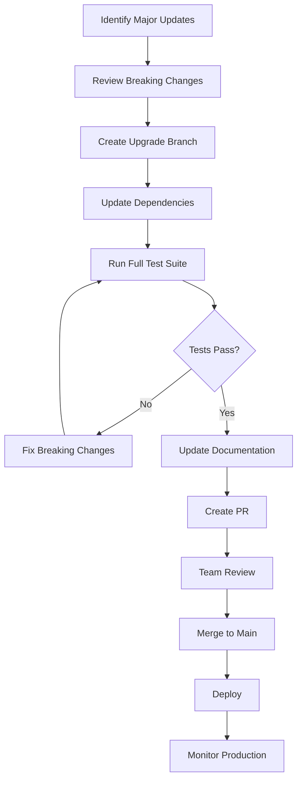

# Maintenance Overview

This guide covers regular maintenance tasks for projects using the Aspect Workflows Template.

## Table of Contents

1. [Daily Maintenance](#daily-maintenance)
2. [Weekly Maintenance](#weekly-maintenance)
3. [Monthly Maintenance](#monthly-maintenance)
4. [Quarterly Maintenance](#quarterly-maintenance)
5. [Maintenance Workflows](#maintenance-workflows)
6. [Automation](#automation)
7. [Documentation](#documentation)

## Daily Maintenance

### Monitor CI/CD Pipelines

Check pipeline health every day:

```bash
# GitHub Actions - check via CLI
gh run list --limit 20

# Or view in dashboard
open https://github.com/your-org/your-repo/actions
```

**What to look for:**

- Failed builds
- Slow builds (>10min)
- Flaky tests
- Resource issues

### Review Security Alerts

Check for security vulnerabilities:

```bash
# GitHub security alerts
gh api repos/:owner/:repo/vulnerability-alerts

# Dependabot alerts
gh api repos/:owner/:repo/dependabot/alerts
```

**Action items:**

- Critical vulnerabilities: Fix immediately
- High severity: Fix within 24 hours
- Medium/Low: Schedule for next sprint

### Check Build Cache Health

Monitor cache performance:

```bash
# Check cache stats (if using remote cache)
# This depends on your cache provider

# Google Cloud Storage
gsutil du -sh gs://your-bazel-cache

# Local cache size
du -sh ~/.cache/bazel
```

**Optimal metrics:**

- Cache hit rate: >80%
- Cache size: Growing steadily but not unbounded
- Network latency: <100ms to cache

## Weekly Maintenance

### Review Dependency Updates

Check and merge Renovate PRs:

```bash
# List open Renovate PRs
gh pr list --author "renovate[bot]"

# Review specific PR
gh pr view <PR-NUMBER>

# Merge if tests pass
gh pr merge <PR-NUMBER> --squash
```

**Decision matrix:**

| Update Type | Action |
|-------------|--------|
| Patch updates (1.0.0 → 1.0.1) | Auto-merge if tests pass |
| Minor updates (1.0.0 → 1.1.0) | Review changelog, merge |
| Major updates (1.0.0 → 2.0.0) | Careful review, test thoroughly |
| Security updates | Merge immediately |

### Build Performance Review

Analyze build performance trends:

```bash
# Generate build profile
bazel build --profile=profile.json //...

# Analyze profile
bazel analyze-profile profile.json

# Generate HTML report
bazel analyze-profile --html profile.json > report.html
open report.html
```

**Key metrics:**

- Total build time
- Slowest targets
- Cache hit rate
- Network time

### Test Stability Check

Identify flaky tests:

```bash
# Run tests multiple times
for i in {1..10}; do
  bazel test //... --test_output=errors
done

# Or use test repeater
bazel test //... --runs_per_test=10 --test_output=errors
```

**Address flaky tests:**

1. Identify the flaky test
2. Add `flaky = True` temporarily
3. Investigate and fix root cause
4. Remove `flaky = True` when fixed

### Documentation Updates

Review and update docs based on:

- Recent changes
- User questions
- Common issues
- New features

```bash
# Check for outdated docs
find docs -name "*.md" -mtime +90  # Files not modified in 90 days

# Review and update as needed
```

## Monthly Maintenance

### Bazel Version Update

Check for new Bazel releases:

```bash
# Check current version
bazel version

# Check latest release
curl -s https://api.github.com/repos/bazelbuild/bazel/releases/latest | grep tag_name

# Update .bazelversion
echo "7.1.0" > .bazelversion

# Test with new version
bazel clean --expunge
bazel test //...
```

**Update checklist:**

- [ ] Update `.bazelversion`
- [ ] Update CI configuration
- [ ] Run full test suite
- [ ] Update documentation
- [ ] Notify team of upgrade

### Toolchain Version Review

Update language toolchains:

```bash
# Check current versions in MODULE.bazel
grep "version =" MODULE.bazel

# Update to latest stable versions
vim MODULE.bazel
```

**Example updates:**

```python
# MODULE.bazel

# Python
python = use_extension("@rules_python//python:extensions.bzl", "python")
python.toolchain(
    python_version = "3.11.7",  # Update this
)

# Node.js
node = use_extension("@rules_js//js:extensions.bzl", "node")
node.toolchain(
    node_version = "20.11.0",  # Update this
)

# Go
go_sdk = use_extension("@rules_go//go:extensions.bzl", "go_sdk")
go_sdk.download(version = "1.21.6")  # Update this
```

### Security Audit

Comprehensive security review:

```bash
# Python dependencies
pip-audit requirements/all.txt

# JavaScript dependencies
pnpm audit
pnpm audit --fix

# Go dependencies
go list -json -m all | nancy sleuth

# Container images (if using)
trivy image your-image:tag
```

**Security checklist:**

- [ ] Scan all dependencies
- [ ] Review security advisories
- [ ] Update vulnerable packages
- [ ] Test after updates
- [ ] Document any exceptions

### Cache Cleanup

Clean up old cache entries:

```bash
# Local cache cleanup
bazel clean --expunge_async

# Remote cache cleanup (GCS example)
# Delete objects older than 90 days
gsutil -m rm -r gs://your-bazel-cache/**/*$(date -d '90 days ago' +%Y-%m-%d)*

# Or use lifecycle rules (recommended)
```

**Cache lifecycle policy (GCS example):**

```json
{
  "lifecycle": {
    "rule": [{
      "action": {"type": "Delete"},
      "condition": {
        "age": 90,
        "matchesPrefix": ["bazel-cache/"]
      }
    }]
  }
}
```

### Performance Optimization

Review and optimize slow builds:

```bash
# Find slowest targets
bazel query 'kind(.*_test, //...)' --output=label | \
  xargs -I {} bazel cquery --output=starlark --starlark:file=timing.bzl {}

# Profile specific target
bazel build --profile=target.json //path/to:slow_target
bazel analyze-profile target.json
```

**Optimization strategies:**

1. Split large targets into smaller ones
2. Add more granular dependencies
3. Enable remote execution
4. Optimize test setup/teardown

## Quarterly Maintenance

### Major Dependency Upgrades

Plan and execute major version upgrades:

```bash
# Identify major updates available
pnpm outdated
pip list --outdated
go list -u -m all

# Plan upgrade strategy
# 1. Review breaking changes
# 2. Update in feature branch
# 3. Run comprehensive tests
# 4. Update documentation
# 5. Communicate to team
```

**Upgrade process:**



### CI/CD Configuration Review

Review and optimize CI/CD setup:

```yaml
# .github/workflows/ci.yml review checklist
# - Are jobs running in parallel?
# - Is caching configured properly?
# - Are workflows triggered appropriately?
# - Are secrets managed securely?
# - Is resource usage optimized?
```

**Optimization checklist:**

- [ ] Enable job parallelization
- [ ] Configure build caching
- [ ] Use matrix strategies for multi-platform tests
- [ ] Optimize Docker layer caching
- [ ] Review and remove unused workflows

### Disaster Recovery Test

Test backup and recovery procedures:

```bash
# Simulate cache loss
rm -rf ~/.cache/bazel
bazel clean --expunge

# Rebuild from scratch
time bazel build //...

# Verify all tests pass
bazel test //...

# Document recovery time
echo "Cold build time: $(time bazel build //...)"
```

**Recovery test scenarios:**

1. Lost local cache
2. Lost remote cache
3. Lost CI configuration
4. Lost credentials (restore from backup)

### Documentation Review

Comprehensive documentation audit:

```bash
# Find all documentation
find docs -name "*.md"

# Check for broken links
# Use markdown-link-check or similar tool
npx markdown-link-check docs/**/*.md

# Review and update outdated content
```

**Documentation checklist:**

- [ ] All links work
- [ ] Examples are up to date
- [ ] New features documented
- [ ] Deprecated features marked
- [ ] Screenshots current
- [ ] API docs match implementation

### Team Training Review

Assess and plan team training:

**Topics to cover:**

- New Bazel features
- Template updates
- Best practices
- Tool updates
- Common issues and solutions

**Training formats:**

- Lunch and learns
- Pair programming sessions
- Documentation updates
- Video tutorials
- Hands-on workshops

## Maintenance Workflows

### Workflow 1: Dependency Update

```bash
#!/bin/bash
# update-dependencies.sh

echo "Starting dependency update..."

# Python
echo "Updating Python dependencies..."
./tools/repin

# JavaScript
echo "Updating JavaScript dependencies..."
pnpm update

# Go
echo "Updating Go dependencies..."
go get -u ./...
go mod tidy
bazel mod tidy

# Java
echo "Updating Java dependencies..."
vim MODULE.bazel  # Update versions
bazel run @unpinned_maven//:pin

# Test everything
echo "Running tests..."
bazel test //...

echo "Dependency update complete!"
```

### Workflow 2: Security Patch

```bash
#!/bin/bash
# apply-security-patch.sh

PACKAGE=$1
VERSION=$2

echo "Applying security patch for $PACKAGE to $VERSION..."

# Update the package
# (Specific to your package manager)

# Run tests
bazel test //...

# Run security scan
./scripts/security-scan.sh

# Create PR
git checkout -b security/$PACKAGE-$VERSION
git add .
git commit -m "security: update $PACKAGE to $VERSION"
git push origin security/$PACKAGE-$VERSION
gh pr create --title "Security: Update $PACKAGE to $VERSION" --body "Security patch"

echo "Security patch PR created!"
```

### Workflow 3: Performance Investigation

```bash
#!/bin/bash
# investigate-performance.sh

TARGET=$1

echo "Investigating performance of $TARGET..."

# Profile the target
bazel build --profile=profile.json $TARGET

# Analyze profile
bazel analyze-profile profile.json > analysis.txt

# Find bottlenecks
grep "CRITICAL PATH" analysis.txt
grep "Total time" analysis.txt

# Generate HTML report
bazel analyze-profile --html profile.json > profile.html

echo "Performance analysis complete. See profile.html"
open profile.html
```

## Automation

### Automated Daily Tasks

```yaml
# .github/workflows/daily-maintenance.yml
name: Daily Maintenance

on:
  schedule:
    - cron: '0 9 * * *'  # 9 AM daily
  workflow_dispatch:

jobs:
  health-check:
    runs-on: ubuntu-latest
    steps:
      - uses: actions/checkout@v3
      
      - name: Check build health
        run: bazel build //...
      
      - name: Run tests
        run: bazel test //...
      
      - name: Check cache stats
        run: ./scripts/cache-stats.sh
      
      - name: Generate report
        run: ./scripts/health-report.sh
      
      - name: Send notification
        if: failure()
        uses: actions/github-script@v6
        with:
          script: |
            github.rest.issues.create({
              owner: context.repo.owner,
              repo: context.repo.repo,
              title: 'Daily health check failed',
              body: 'The daily maintenance build failed. Please investigate.',
              labels: ['maintenance', 'automated']
            })
```

### Automated Weekly Tasks

```yaml
# .github/workflows/weekly-maintenance.yml
name: Weekly Maintenance

on:
  schedule:
    - cron: '0 10 * * 1'  # 10 AM Monday
  workflow_dispatch:

jobs:
  dependency-review:
    runs-on: ubuntu-latest
    steps:
      - uses: actions/checkout@v3
      
      - name: List outdated dependencies
        run: |
          echo "## Outdated Dependencies" > report.md
          echo "### JavaScript" >> report.md
          pnpm outdated >> report.md
          echo "### Python" >> report.md
          pip list --outdated >> report.md
      
      - name: Create issue
        uses: actions/github-script@v6
        with:
          script: |
            const fs = require('fs');
            const report = fs.readFileSync('report.md', 'utf8');
            github.rest.issues.create({
              owner: context.repo.owner,
              repo: context.repo.repo,
              title: 'Weekly Dependency Review',
              body: report,
              labels: ['maintenance', 'dependencies']
            })
```

### Automated Monthly Tasks

```yaml
# .github/workflows/monthly-maintenance.yml
name: Monthly Maintenance

on:
  schedule:
    - cron: '0 11 1 * *'  # 11 AM first day of month
  workflow_dispatch:

jobs:
  monthly-audit:
    runs-on: ubuntu-latest
    steps:
      - uses: actions/checkout@v3
      
      - name: Security audit
        run: |
          pnpm audit --json > audit.json
          pip-audit --format json > pip-audit.json
      
      - name: Performance benchmarks
        run: ./scripts/run-benchmarks.sh
      
      - name: Generate monthly report
        run: ./scripts/monthly-report.sh
      
      - name: Upload report
        uses: actions/upload-artifact@v3
        with:
          name: monthly-report
          path: reports/
```

## Documentation

### Maintenance Log

Keep a maintenance log for tracking:

```markdown
# Maintenance Log

## 2024-01-15 - Dependency Updates
- Updated rules_go to 0.44.0
- Updated Node.js to 20.11.0
- All tests passing
- No breaking changes

## 2024-01-10 - Security Patch
- Applied security patch for lodash (CVE-2024-1234)
- Updated from 4.17.20 to 4.17.21
- Ran security scan - no vulnerabilities found

## 2024-01-05 - Performance Optimization
- Optimized slow test suite in //src/app:tests
- Reduced test time from 5min to 2min
- Added test sharding (4 shards)
```

### Runbooks

Create runbooks for common scenarios:

#### Runbook: Build Cache Full

```markdown
## Symptom
Remote cache storage approaching limit

## Investigation
1. Check cache size: `gsutil du -sh gs://cache`
2. Check oldest objects: `gsutil ls -l gs://cache | head`

## Resolution
1. Set lifecycle policy to delete after 90 days
2. Or manually clean: `gsutil -m rm -r gs://cache/old/*`
3. Monitor for 24 hours

## Prevention
- Set automatic lifecycle policies
- Monitor cache size weekly
```

## Best Practices

### DO

- ✅ Automate repetitive tasks
- ✅ Document all maintenance actions
- ✅ Test after every change
- ✅ Keep maintenance schedule consistent
- ✅ Monitor key metrics
- ✅ Communicate changes to team
- ✅ Maintain rollback procedures

### DON'T

- ❌ Skip testing after updates
- ❌ Apply patches without review
- ❌ Ignore security alerts
- ❌ Let technical debt accumulate
- ❌ Make changes during peak hours
- ❌ Update everything at once

## Next Steps

- Review [Dependency Management](./dependency-management.md) details
- Configure [CI/CD](./ci-cd.md) automation
- Set up [Monitoring](./monitoring.md) dashboards

---

**Back**: [Admin Guide](./README.md) | **Next**: [Dependency Management](./dependency-management.md)
