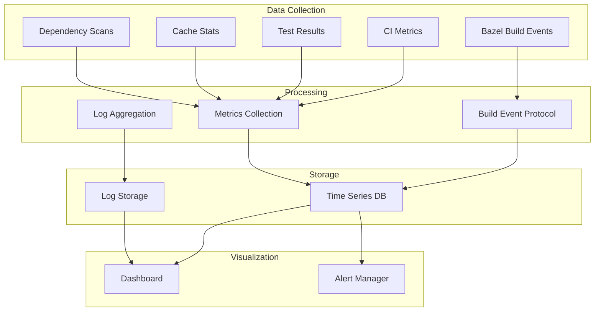

# Monitoring

This guide covers monitoring and observability for projects using the Aspect Workflows Template.

## Table of Contents

1. [Overview](#overview)
2. [Build Metrics](#build-metrics)
3. [Performance Monitoring](#performance-monitoring)
4. [CI/CD Monitoring](#cicd-monitoring)
5. [Dependency Health](#dependency-health)
6. [Alerting](#alerting)
7. [Dashboards](#dashboards)

## Overview

Effective monitoring tracks:

- Build performance and trends
- Cache effectiveness
- Test stability
- Dependency health
- CI/CD pipeline health
- Resource utilization

### Monitoring Architecture



## Build Metrics

### Build Event Protocol (BEP)

Bazel's Build Event Protocol provides detailed build information.

**Enable BEP:**

```bash
# .bazelrc
build --build_event_json_file=bep.json
build --build_event_text_file=bep.txt
```

**Key metrics to track:**

```bash
# Extract metrics from BEP
cat bep.json | jq -r '
  .[] | select(.started != null) | 
  {
    target: .id.targetCompleted.label,
    duration: (.finished.finishTimeMillis - .started.startTimeMillis),
    success: .completed.success
  }
'

# Cache hit rate
cat bep.json | jq '
  [.[] | select(.action != null)] |
  {
    total: length,
    cached: [.[] | select(.action.cacheMissReason == null)] | length,
    hit_rate: ([.[] | select(.action.cacheMissReason == null)] | length) / length * 100
  }
'
```

### Tracking Build Times

**Build time metrics:**

```bash
#!/usr/bin/env bash
# scripts/track-build-time.sh

START_TIME=$(date +%s)

bazel build //... \
  --build_event_json_file=bep.json \
  --profile=profile.json

END_TIME=$(date +%s)
DURATION=$((END_TIME - START_TIME))

# Extract metrics
CACHE_HITS=$(jq '[.[] | select(.action.cacheMissReason == null)] | length' bep.json)
TOTAL_ACTIONS=$(jq '[.[] | select(.action != null)] | length' bep.json)
CACHE_HIT_RATE=$((CACHE_HITS * 100 / TOTAL_ACTIONS))

# Log to monitoring system
echo "build_duration_seconds $DURATION"
echo "build_cache_hit_rate $CACHE_HIT_RATE"
echo "build_total_actions $TOTAL_ACTIONS"

# Send to metrics backend (example: Prometheus Pushgateway)
cat <<EOF | curl --data-binary @- http://pushgateway:9091/metrics/job/bazel_build
build_duration_seconds $DURATION
build_cache_hit_rate $CACHE_HIT_RATE
build_total_actions $TOTAL_ACTIONS
EOF
```

### Build Trend Analysis

```python
#!/usr/bin/env python3
# scripts/analyze-build-trends.py

import json
import sys
from datetime import datetime
import statistics

def analyze_builds(bep_files):
    metrics = []
    
    for bep_file in bep_files:
        with open(bep_file) as f:
            events = [json.loads(line) for line in f]
        
        # Extract build duration
        started = next(e for e in events if 'started' in e)
        finished = next(e for e in events if 'finished' in e)
        
        duration = (finished['finished']['finishTimeMillis'] - 
                   started['started']['startTimeMillis']) / 1000
        
        # Count actions
        actions = [e for e in events if 'action' in e]
        cached = sum(1 for a in actions 
                    if a.get('action', {}).get('cacheMissReason') is None)
        
        metrics.append({
            'duration': duration,
            'actions': len(actions),
            'cached': cached,
            'hit_rate': cached / len(actions) if actions else 0
        })
    
    # Analyze trends
    print(f"Average build time: {statistics.mean(m['duration'] for m in metrics):.2f}s")
    print(f"Average cache hit rate: {statistics.mean(m['hit_rate'] for m in metrics):.2%}")
    print(f"Slowest build: {max(m['duration'] for m in metrics):.2f}s")
    print(f"Fastest build: {min(m['duration'] for m in metrics):.2f}s")

if __name__ == '__main__':
    analyze_builds(sys.argv[1:])
```

## Performance Monitoring

### Critical Metrics

#### 1. Build Duration

```sql
-- Example Prometheus query
rate(build_duration_seconds[5m])

-- Alert on slow builds
build_duration_seconds > 600  # >10 minutes
```

#### 2. Cache Hit Rate

```sql
-- Cache hit percentage
(build_cache_hits / build_total_actions) * 100

-- Alert on low cache hit rate
(build_cache_hits / build_total_actions) < 0.8  # <80%
```

#### 3. Test Duration

```sql
-- Test duration trend
sum(test_duration_seconds) by (target)

-- Flaky test rate
sum(test_flaky_count) / sum(test_total_count)
```

#### 4. Resource Usage

```sql
-- CPU usage
avg(build_cpu_usage_percent) by (instance)

-- Memory usage
avg(build_memory_usage_bytes) by (instance)

-- Disk I/O
rate(build_disk_io_bytes[5m])
```

### Performance Profiling

```bash
# Generate profile
bazel build --profile=profile.json //...

# Analyze critical path
bazel analyze-profile profile.json | head -50

# Generate HTML report
bazel analyze-profile --html profile.json > profile.html

# Find slow actions
jq '[.[] | select(.dur > 1000000)] | sort_by(-.dur) | .[0:10]' profile.json

# Save for historical comparison
mkdir -p profiles/
cp profile.json profiles/profile-$(date +%Y%m%d-%H%M%S).json
```

### Benchmark Tracking

```python
#!/usr/bin/env bash
# scripts/run-benchmarks.sh

OUTPUT_FILE="benchmarks/results-$(date +%Y%m%d).json"

# Run benchmarks
bazel run //benchmarks:all --profile=bench-profile.json

# Extract results
jq '{
  date: now,
  results: [
    .[] | select(.testResult != null) | {
      name: .id.testResult.label,
      duration: .testResult.testAttemptDurationMillis,
      status: .testResult.status
    }
  ]
}' bench-profile.json > "$OUTPUT_FILE"

# Compare with baseline
python3 scripts/compare-benchmarks.py \
  benchmarks/baseline.json \
  "$OUTPUT_FILE"
```

## CI/CD Monitoring

### GitHub Actions Metrics

```yaml
# .github/workflows/metrics.yml
name: CI Metrics

on:
  workflow_run:
    workflows: ["CI"]
    types:
      - completed

jobs:
  metrics:
    runs-on: ubuntu-latest
    steps:
      - name: Get workflow metrics
        uses: actions/github-script@v6
        with:
          script: |
            const run = context.payload.workflow_run;
            
            const metrics = {
              workflow: run.name,
              status: run.conclusion,
              duration: (new Date(run.updated_at) - new Date(run.created_at)) / 1000,
              attempt: run.run_attempt
            };
            
            console.log(JSON.stringify(metrics));
            
            // Send to metrics backend
            await fetch('https://metrics.example.com/ci', {
              method: 'POST',
              body: JSON.stringify(metrics)
            });
```

### CI Success Rate

```bash
# Query CI success rate
gh api graphql -f query='
  query($owner: String!, $repo: String!) {
    repository(owner: $owner, name: $repo) {
      ref(qualifiedName: "main") {
        target {
          ... on Commit {
            history(first: 100) {
              nodes {
                checkSuites(first: 10) {
                  nodes {
                    conclusion
                    createdAt
                  }
                }
              }
            }
          }
        }
      }
    }
  }
' -f owner=OWNER -f repo=REPO | \
jq '[.data.repository.ref.target.history.nodes[].checkSuites.nodes[] | .conclusion] | 
    group_by(.) | 
    map({status: .[0], count: length})'
```

### Pipeline Health Dashboard

```python
#!/usr/bin/env python3
# scripts/ci-health.py

import requests
import sys

def get_ci_health(owner, repo, token):
    headers = {'Authorization': f'token {token}'}
    
    # Get recent workflow runs
    url = f'https://api.github.com/repos/{owner}/{repo}/actions/runs'
    response = requests.get(url, headers=headers, params={'per_page': 100})
    runs = response.json()['workflow_runs']
    
    # Calculate metrics
    total = len(runs)
    successful = sum(1 for r in runs if r['conclusion'] == 'success')
    failed = sum(1 for r in runs if r['conclusion'] == 'failure')
    
    success_rate = successful / total if total > 0 else 0
    
    # Average duration
    durations = [
        (r['updated_at'] - r['created_at']).total_seconds() 
        for r in runs if r['conclusion'] == 'success'
    ]
    avg_duration = sum(durations) / len(durations) if durations else 0
    
    print(f"CI Health Report for {owner}/{repo}")
    print(f"Success Rate: {success_rate:.2%}")
    print(f"Average Duration: {avg_duration:.0f}s")
    print(f"Failed Runs: {failed}/{total}")

if __name__ == '__main__':
    get_ci_health(sys.argv[1], sys.argv[2], sys.argv[3])
```

## Dependency Health

### Vulnerability Tracking

```yaml
# .github/workflows/dependency-health.yml
name: Dependency Health

on:
  schedule:
    - cron: '0 0 * * *'  # Daily

jobs:
  track:
    runs-on: ubuntu-latest
    steps:
      - uses: actions/checkout@v4
      
      - name: Scan dependencies
        run: |
          # Python
          pip-audit --format json requirements/all.txt > python-vulns.json
          
          # JavaScript
          pnpm audit --json > js-vulns.json
          
          # Go
          go list -json -m all | nancy sleuth --output json > go-vulns.json
      
      - name: Process results
        run: |
          python3 << 'EOF'
          import json
          
          def count_vulns(file):
              with open(file) as f:
                  data = json.load(f)
              return {
                  'critical': len([v for v in data if v['severity'] == 'critical']),
                  'high': len([v for v in data if v['severity'] == 'high']),
                  'medium': len([v for v in data if v['severity'] == 'medium']),
                  'low': len([v for v in data if v['severity'] == 'low'])
              }
          
          metrics = {
              'python': count_vulns('python-vulns.json'),
              'javascript': count_vulns('js-vulns.json'),
              'go': count_vulns('go-vulns.json')
          }
          
          print(json.dumps(metrics, indent=2))
          
          # Send to monitoring
          # requests.post('https://metrics.example.com/deps', json=metrics)
          EOF
```

### Outdated Dependencies

```bash
#!/usr/bin/env bash
# scripts/check-outdated.sh

echo "=== Outdated Dependencies ==="
echo

echo "Python:"
pip list --outdated --format=json | jq -r '.[] | "\(.name): \(.version) -> \(.latest_version)"'

echo
echo "JavaScript:"
pnpm outdated --format json | jq -r '.[] | "\(.name): \(.current) -> \(.latest)"'

echo
echo "Go:"
go list -u -m all | grep '\['

# Count outdated
PYTHON_OUTDATED=$(pip list --outdated --format=json | jq 'length')
JS_OUTDATED=$(pnpm outdated --format json | jq 'length')
GO_OUTDATED=$(go list -u -m all | grep -c '\[' || echo 0)

echo
echo "Summary:"
echo "Python: $PYTHON_OUTDATED outdated"
echo "JavaScript: $JS_OUTDATED outdated"
echo "Go: $GO_OUTDATED outdated"

# Send metrics
curl -X POST https://metrics.example.com/deps/outdated \
  -d "python=$PYTHON_OUTDATED" \
  -d "javascript=$JS_OUTDATED" \
  -d "go=$GO_OUTDATED"
```

## Alerting

### Alert Rules

**Prometheus alert rules:**

```yaml
# alerts.yml
groups:
  - name: build_alerts
    interval: 1m
    rules:
      - alert: SlowBuild
        expr: build_duration_seconds > 600
        for: 5m
        labels:
          severity: warning
        annotations:
          summary: "Build taking too long"
          description: "Build duration {{ $value }}s exceeds 10m threshold"
      
      - alert: LowCacheHitRate
        expr: (build_cache_hits / build_total_actions) < 0.7
        for: 10m
        labels:
          severity: warning
        annotations:
          summary: "Low cache hit rate"
          description: "Cache hit rate {{ $value | humanizePercentage }} below 70%"
      
      - alert: BuildFailure
        expr: build_failed_count > 0
        for: 1m
        labels:
          severity: critical
        annotations:
          summary: "Build failed"
          description: "{{ $value }} builds have failed"
      
      - alert: FlakyTests
        expr: rate(test_flaky_count[1h]) > 5
        for: 5m
        labels:
          severity: warning
        annotations:
          summary: "High flaky test rate"
          description: "{{ $value }} flaky tests per hour"
      
      - alert: CriticalVulnerability
        expr: dependency_vulnerabilities{severity="critical"} > 0
        for: 1m
        labels:
          severity: critical
        annotations:
          summary: "Critical vulnerability detected"
          description: "{{ $value }} critical vulnerabilities in dependencies"
```

### Notification Channels

**Slack notifications:**

```yaml
# .github/workflows/alert-slack.yml
name: Alert to Slack

on:
  schedule:
    - cron: '0 */6 * * *'  # Every 6 hours
  workflow_dispatch:

jobs:
  check-health:
    runs-on: ubuntu-latest
    steps:
      - uses: actions/checkout@v4
      
      - name: Check metrics
        id: metrics
        run: |
          # Collect metrics
          CACHE_HIT=$(get_cache_hit_rate)
          BUILD_TIME=$(get_avg_build_time)
          
          echo "cache_hit=$CACHE_HIT" >> $GITHUB_OUTPUT
          echo "build_time=$BUILD_TIME" >> $GITHUB_OUTPUT
      
      - name: Send alert if needed
        if: steps.metrics.outputs.cache_hit < 70
        uses: 8398a7/action-slack@v3
        with:
          status: custom
          custom_payload: |
            {
              text: "⚠️ Build System Alert",
              attachments: [{
                color: 'warning',
                fields: [{
                  title: 'Cache Hit Rate',
                  value: '${{ steps.metrics.outputs.cache_hit }}%',
                  short: true
                }, {
                  title: 'Avg Build Time',
                  value: '${{ steps.metrics.outputs.build_time }}s',
                  short: true
                }]
              }]
            }
          webhook_url: ${{ secrets.SLACK_WEBHOOK }}
```

**Email notifications:**

```python
#!/usr/bin/env python3
# scripts/send-alert-email.py

import smtplib
from email.message import EmailMessage

def send_alert(subject, body, recipients):
    msg = EmailMessage()
    msg.set_content(body)
    msg['Subject'] = subject
    msg['From'] = 'alerts@example.com'
    msg['To'] = ', '.join(recipients)
    
    with smtplib.SMTP('smtp.example.com', 587) as smtp:
        smtp.starttls()
        smtp.login('user', 'password')
        smtp.send_message(msg)

if __name__ == '__main__':
    send_alert(
        subject='Build Alert: Low Cache Hit Rate',
        body='Cache hit rate dropped below 70%',
        recipients=['team@example.com']
    )
```

## Dashboards

### Grafana Dashboard

**Build metrics dashboard:**

```json
{
  "dashboard": {
    "title": "Bazel Build Metrics",
    "panels": [
      {
        "title": "Build Duration",
        "type": "graph",
        "targets": [{
          "expr": "build_duration_seconds",
          "legendFormat": "Duration"
        }]
      },
      {
        "title": "Cache Hit Rate",
        "type": "gauge",
        "targets": [{
          "expr": "(build_cache_hits / build_total_actions) * 100"
        }],
        "thresholds": [
          {"value": 70, "color": "red"},
          {"value": 80, "color": "yellow"},
          {"value": 90, "color": "green"}
        ]
      },
      {
        "title": "Test Pass Rate",
        "type": "stat",
        "targets": [{
          "expr": "(test_passed_count / test_total_count) * 100"
        }]
      },
      {
        "title": "Build Status",
        "type": "table",
        "targets": [{
          "expr": "build_status"
        }]
      }
    ]
  }
}
```

### Custom Dashboard

```html
<!-- dashboard.html -->
<!DOCTYPE html>
<html>
<head>
    <title>Build Dashboard</title>
    <script src="https://cdn.jsdelivr.net/npm/chart.js"></script>
</head>
<body>
    <h1>Build System Dashboard</h1>
    
    <div>
        <h2>Build Duration (Last 7 Days)</h2>
        <canvas id="buildDurationChart"></canvas>
    </div>
    
    <div>
        <h2>Cache Hit Rate</h2>
        <canvas id="cacheHitChart"></canvas>
    </div>
    
    <script>
        // Fetch metrics
        fetch('/api/metrics/build-duration')
            .then(r => r.json())
            .then(data => {
                new Chart(document.getElementById('buildDurationChart'), {
                    type: 'line',
                    data: {
                        labels: data.labels,
                        datasets: [{
                            label: 'Build Duration (s)',
                            data: data.values,
                            borderColor: 'rgb(75, 192, 192)'
                        }]
                    }
                });
            });
        
        fetch('/api/metrics/cache-hit-rate')
            .then(r => r.json())
            .then(data => {
                new Chart(document.getElementById('cacheHitChart'), {
                    type: 'line',
                    data: {
                        labels: data.labels,
                        datasets: [{
                            label: 'Cache Hit Rate (%)',
                            data: data.values,
                            borderColor: 'rgb(255, 99, 132)'
                        }]
                    },
                    options: {
                        scales: {
                            y: {
                                beginAtZero: true,
                                max: 100
                            }
                        }
                    }
                });
            });
    </script>
</body>
</html>
```

## Best Practices

### DO

- ✅ Track key metrics consistently
- ✅ Set up alerts for critical issues
- ✅ Monitor trends over time
- ✅ Create actionable dashboards
- ✅ Review metrics regularly
- ✅ Document baseline performance
- ✅ Investigate anomalies promptly

### DON'T

- ❌ Monitor everything (focus on key metrics)
- ❌ Ignore alerts
- ❌ Set alert thresholds too tight
- ❌ Forget to update baselines
- ❌ Create dashboards nobody uses
- ❌ Collect metrics without acting on them

## Example Monitoring Stack

```yaml
# docker-compose.yml for monitoring stack
version: '3.8'

services:
  prometheus:
    image: prom/prometheus:latest
    volumes:
      - ./prometheus.yml:/etc/prometheus/prometheus.yml
      - prometheus-data:/prometheus
    ports:
      - "9090:9090"
  
  grafana:
    image: grafana/grafana:latest
    volumes:
      - grafana-data:/var/lib/grafana
    ports:
      - "3000:3000"
    environment:
      - GF_SECURITY_ADMIN_PASSWORD=admin
  
  pushgateway:
    image: prom/pushgateway:latest
    ports:
      - "9091:9091"

volumes:
  prometheus-data:
  grafana-data:
```

```yaml
# prometheus.yml
global:
  scrape_interval: 15s

scrape_configs:
  - job_name: 'pushgateway'
    static_configs:
      - targets: ['pushgateway:9091']
  
  - job_name: 'bazel_builds'
    static_configs:
      - targets: ['localhost:9090']
```

## Next Steps

- Review [Maintenance](./maintenance.md) schedules
- Configure [Security](./security.md) monitoring
- Set up [CI/CD](./ci-cd.md) metrics collection

---

**Back**: [Troubleshooting](./troubleshooting.md) | **Up**: [Admin Guide](./README.md)
