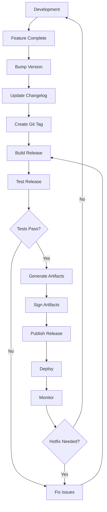

# Release Management

This guide covers release processes and version management for projects using the Aspect Workflows Template.

## Table of Contents

1. [Overview](#overview)
2. [Versioning Strategy](#versioning-strategy)
3. [Release Process](#release-process)
4. [Version Stamping](#version-stamping)
5. [Changelog Management](#changelog-management)
6. [Release Automation](#release-automation)
7. [Best Practices](#best-practices)

## Overview

Release management includes:

- Version numbering (semantic versioning)
- Build artifact creation
- Version stamping in binaries
- Changelog generation
- Release notes
- Deployment coordination

### Release Workflow



## Versioning Strategy

### Semantic Versioning

Follow [Semantic Versioning 2.0.0](https://semver.org/):

```text
MAJOR.MINOR.PATCH

Examples:
1.0.0  - Initial release
1.0.1  - Patch (bug fixes)
1.1.0  - Minor (new features, backward compatible)
2.0.0  - Major (breaking changes)
```

**Version components:**

- **MAJOR**: Incompatible API changes
- **MINOR**: New functionality, backward compatible
- **PATCH**: Backward compatible bug fixes

**Pre-release versions:**

```text
1.0.0-alpha.1  - Alpha release
1.0.0-beta.1   - Beta release
1.0.0-rc.1     - Release candidate
```

### Version File

Maintain version in a single source of truth:

```python
# VERSION file
1.2.3
```

Or in package file:

```json
// package.json
{
  "version": "1.2.3"
}
```

```toml
# pyproject.toml
[project]
version = "1.2.3"
```

## Release Process

### Step-by-Step Release

**1. Prepare release branch:**

```bash
# Create release branch from main
git checkout main
git pull origin main
git checkout -b release/v1.2.3
```

**2. Update version:**

```bash
# Update VERSION file
echo "1.2.3" > VERSION

# Or update package.json
npm version 1.2.3 --no-git-tag-version

# Or update pyproject.toml
vim pyproject.toml
```

**3. Update changelog:**

```bash
vim CHANGELOG.md

# Add release notes
## [1.2.3] - 2024-01-15

### Added
- New feature X (#123)
- New feature Y (#124)

### Fixed
- Bug fix A (#125)
- Bug fix B (#126)

### Changed
- Improvement C (#127)
```

**4. Commit changes:**

```bash
git add VERSION CHANGELOG.md
git commit -m "chore: release v1.2.3"
git push origin release/v1.2.3
```

**5. Create pull request:**

```bash
gh pr create \
  --title "Release v1.2.3" \
  --body "Release version 1.2.3" \
  --base main
```

**6. Merge and tag:**

```bash
# After PR approval
gh pr merge --squash

# Checkout main
git checkout main
git pull origin main

# Create and push tag
git tag -a v1.2.3 -m "Release v1.2.3"
git push origin v1.2.3
```

**7. Build release:**

```bash
# Build with version stamping
bazel build --config=release //...

# Run release tests
bazel test --config=release //...
```

**8. Create GitHub release:**

```bash
gh release create v1.2.3 \
  --title "Release v1.2.3" \
  --notes-file CHANGELOG.md \
  bazel-bin/app/app_linux_amd64 \
  bazel-bin/app/app_darwin_amd64 \
  bazel-bin/app/app_windows_amd64.exe
```

### Hotfix Process

For urgent fixes:

```bash
# Create hotfix branch from tag
git checkout v1.2.3
git checkout -b hotfix/v1.2.4

# Make fix
git commit -m "fix: critical bug"

# Update version
echo "1.2.4" > VERSION
git commit -am "chore: bump to v1.2.4"

# Tag and release
git tag -a v1.2.4 -m "Hotfix v1.2.4"
git push origin v1.2.4

# Merge back to main
git checkout main
git merge hotfix/v1.2.4
git push origin main
```

## Version Stamping

### Bazel Version Stamping

The template supports version stamping when the `stamp` feature is enabled.

**Configuration:**

```python
# tools/workspace_status.sh
#!/bin/bash

echo "STABLE_VERSION $(cat VERSION)"
echo "STABLE_GIT_COMMIT $(git rev-parse HEAD)"
echo "STABLE_GIT_TAG $(git describe --tags --always)"
echo "STABLE_BUILD_TIME $(date -u +%Y-%m-%dT%H:%M:%SZ)"
```

**Usage in rules:**

```python
# BUILD file
py_binary(
    name = "app",
    srcs = ["main.py"],
    stamp = 1,  # Enable stamping
)

# Or use config
bazel build --config=release //app
```

**Access in code:**

```python
# Python
from bazel_tools.build_defs import stamp

def get_version():
    return stamp.STABLE_VERSION

print(f"Version: {get_version()}")
```

```javascript
// JavaScript
const version = process.env.STABLE_VERSION || 'dev';
console.log(`Version: ${version}`);
```

```go
// Go
package main

import "fmt"

var (
    Version   = "dev"
    GitCommit = "unknown"
    BuildTime = "unknown"
)

func main() {
    fmt.Printf("Version: %s\n", Version)
    fmt.Printf("Commit: %s\n", GitCommit)
    fmt.Printf("Built: %s\n", BuildTime)
}
```

**Build with stamping:**

```bash
# Enable stamping
bazel build --stamp //app

# Or use release config
bazel build --config=release //app
```

**.bazelrc configuration:**

```bash
# .bazelrc
build:release --stamp
build:release --workspace_status_command=./tools/workspace_status.sh
build:release -c opt
```

## Changelog Management

### Manual Changelog

```markdown
# CHANGELOG.md

All notable changes to this project will be documented in this file.

The format is based on [Keep a Changelog](https://keepachangelog.com/en/1.0.0/),
and this project adheres to [Semantic Versioning](https://semver.org/spec/v2.0.0.html).

## [Unreleased]

### Added
- Feature in development

## [1.2.3] - 2024-01-15

### Added
- New authentication system (#123)
- Support for Python 3.11 (#124)

### Changed
- Updated dependencies (#125)
- Improved error messages (#126)

### Fixed
- Memory leak in cache (#127)
- Race condition in tests (#128)

### Security
- Fixed CVE-2024-1234 (#129)

## [1.2.2] - 2024-01-01

### Fixed
- Critical bug in API (#120)

## [1.2.0] - 2023-12-15

### Added
- GraphQL support (#110)
- Rate limiting (#111)

[Unreleased]: https://github.com/org/repo/compare/v1.2.3...HEAD
[1.2.3]: https://github.com/org/repo/compare/v1.2.2...v1.2.3
[1.2.2]: https://github.com/org/repo/compare/v1.2.0...v1.2.2
[1.2.0]: https://github.com/org/repo/releases/tag/v1.2.0
```

### Automated Changelog

Use conventional commits for automatic generation:

```bash
# Install changelog generator
npm install -g conventional-changelog-cli

# Generate changelog
conventional-changelog -p angular -i CHANGELOG.md -s

# Or use release-please
npm install -g release-please
release-please release-pr --repo-url=owner/repo
```

**Conventional commit format:**

```text
feat: add new feature
fix: fix bug
docs: update documentation
style: formatting changes
refactor: code restructuring
test: add tests
chore: maintenance tasks
```

## Release Automation

### GitHub Actions Release

```yaml
# .github/workflows/release.yml
name: Release

on:
  push:
    tags:
      - 'v*'

permissions:
  contents: write
  packages: write

jobs:
  build:
    runs-on: ubuntu-latest
    strategy:
      matrix:
        platform:
          - linux_amd64
          - linux_arm64
          - darwin_amd64
          - darwin_arm64
          - windows_amd64
    
    steps:
      - uses: actions/checkout@v4
        with:
          fetch-depth: 0
      
      - name: Setup Bazel
        uses: bazel-contrib/setup-bazel@0.8.0
      
      - name: Build for ${{ matrix.platform }}
        run: |
          bazel build --config=release \
            --platforms=//tools/platforms:${{ matrix.platform }} \
            //app
      
      - name: Package artifacts
        run: |
          mkdir -p dist
          cp bazel-bin/app/app dist/app-${{ matrix.platform }}
          cd dist
          tar czf app-${{ matrix.platform }}.tar.gz app-${{ matrix.platform }}
      
      - name: Upload artifacts
        uses: actions/upload-artifact@v3
        with:
          name: app-${{ matrix.platform }}
          path: dist/app-${{ matrix.platform }}.tar.gz
  
  release:
    needs: build
    runs-on: ubuntu-latest
    
    steps:
      - uses: actions/checkout@v4
      
      - name: Download artifacts
        uses: actions/download-artifact@v3
        with:
          path: dist
      
      - name: Extract version
        id: version
        run: echo "VERSION=${GITHUB_REF#refs/tags/v}" >> $GITHUB_OUTPUT
      
      - name: Generate changelog
        run: |
          sed -n "/## \[${{ steps.version.outputs.VERSION }}\]/,/## \[/p" CHANGELOG.md | \
            sed '$d' > release-notes.md
      
      - name: Create release
        uses: softprops/action-gh-release@v1
        with:
          body_path: release-notes.md
          files: dist/*/*.tar.gz
          draft: false
          prerelease: false
```

### Automated Version Bumping

```yaml
# .github/workflows/version-bump.yml
name: Version Bump

on:
  workflow_dispatch:
    inputs:
      version_type:
        description: 'Version type to bump'
        required: true
        type: choice
        options:
          - patch
          - minor
          - major

jobs:
  bump:
    runs-on: ubuntu-latest
    steps:
      - uses: actions/checkout@v4
        with:
          token: ${{ secrets.PAT }}
      
      - name: Bump version
        run: |
          npm version ${{ github.event.inputs.version_type }} --no-git-tag-version
          NEW_VERSION=$(node -p "require('./package.json').version")
          echo "NEW_VERSION=$NEW_VERSION" >> $GITHUB_ENV
      
      - name: Update changelog
        run: |
          DATE=$(date +%Y-%m-%d)
          sed -i "s/## \[Unreleased\]/## [Unreleased]\n\n## [$NEW_VERSION] - $DATE/" CHANGELOG.md
      
      - name: Create PR
        run: |
          git config user.name github-actions
          git config user.email github-actions@github.com
          git checkout -b release/v$NEW_VERSION
          git add package.json CHANGELOG.md
          git commit -m "chore: release v$NEW_VERSION"
          git push origin release/v$NEW_VERSION
          gh pr create \
            --title "Release v$NEW_VERSION" \
            --body "Automated release PR for v$NEW_VERSION"
```

### Release-Please

Automate releases with release-please:

```yaml
# .github/workflows/release-please.yml
name: Release Please

on:
  push:
    branches:
      - main

permissions:
  contents: write
  pull-requests: write

jobs:
  release-please:
    runs-on: ubuntu-latest
    steps:
      - uses: google-github-actions/release-please-action@v4
        id: release
        with:
          release-type: node
          package-name: my-package
      
      - uses: actions/checkout@v4
        if: ${{ steps.release.outputs.release_created }}
      
      - name: Build and release
        if: ${{ steps.release.outputs.release_created }}
        run: |
          bazel build --config=release //...
          bazel run //app:image.push
```

## Best Practices

### Release Checklist

Before each release:

- [ ] All tests passing
- [ ] Changelog updated
- [ ] Version bumped
- [ ] Documentation updated
- [ ] Dependencies updated
- [ ] Security scan passed
- [ ] Performance regression check
- [ ] Migration guide (if breaking changes)
- [ ] Release notes drafted
- [ ] Deployment plan ready

### Release Cadence

**Regular releases:**

- Patch: As needed (bug fixes)
- Minor: Every 2-4 weeks
- Major: Every 3-6 months

**Schedule example:**

```text
Week 1-2: Development
Week 3: Feature freeze, testing
Week 4: Release preparation
Week 5: Release
Week 6-7: Hotfixes if needed
```

### Communication

**Release announcement template:**

```markdown
# Release v1.2.3 Announcement

We're excited to announce version 1.2.3 is now available!

## Highlights

- New feature X for improved performance
- Support for Y added
- Critical bug Z fixed

## Breaking Changes

None in this release.

## Upgrade Instructions

1. Update your dependency:

   \`\`\`bash
   bazel sync --configure
   \`\`\`

2. Run tests:

   \`\`\`bash
   bazel test //...
   \`\`\`

3. Deploy:

   \`\`\`bash
   ./scripts/deploy.sh
   \`\`\`

## Full Changelog

See [CHANGELOG.md](./CHANGELOG.md) for complete details.

## Support

Report issues at https://github.com/org/repo/issues
```

### Rollback Plan

Always have a rollback strategy:

```bash
# Quick rollback script
#!/bin/bash
# rollback.sh

PREVIOUS_VERSION=$1

if [ -z "$PREVIOUS_VERSION" ]; then
    echo "Usage: ./rollback.sh <version>"
    exit 1
fi

echo "Rolling back to v$PREVIOUS_VERSION..."

# Checkout previous version
git checkout v$PREVIOUS_VERSION

# Build and deploy
bazel build --config=release //...
./scripts/deploy.sh

echo "Rollback complete"
```

### DO

- ✅ Use semantic versioning
- ✅ Maintain detailed changelog
- ✅ Tag releases in git
- ✅ Test releases thoroughly
- ✅ Communicate breaking changes
- ✅ Document upgrade path
- ✅ Plan rollback procedures

### DON'T

- ❌ Release without testing
- ❌ Skip version bumps
- ❌ Forget to update changelog
- ❌ Make breaking changes in patches
- ❌ Release on Fridays (unless urgent)
- ❌ Mix features and fixes in patches

## Troubleshooting

### Version Mismatch

```bash
# Check current version
git describe --tags

# Verify version in files
cat VERSION
grep version package.json
grep version pyproject.toml

# Sync versions
./scripts/sync-versions.sh
```

### Failed Release Build

```bash
# Clean and retry
bazel clean --expunge
bazel build --config=release //...

# Check for uncommitted changes
git status

# Verify tag
git tag -v v1.2.3
```

### Rollback After Release

```bash
# If deployment fails
git checkout v1.2.2  # Previous version
bazel build --config=release //...
./scripts/deploy.sh

# Mark release as pre-release
gh release edit v1.2.3 --prerelease

# Or delete release
gh release delete v1.2.3
git tag -d v1.2.3
git push origin :refs/tags/v1.2.3
```

## Next Steps

- Configure [CI/CD](./ci-cd.md) for automated releases
- Set up [Monitoring](./monitoring.md) for releases
- Review [Security](./security.md) considerations

---

**Back**: [CI/CD Configuration](./ci-cd.md) | **Next**: [Security](./security.md)
