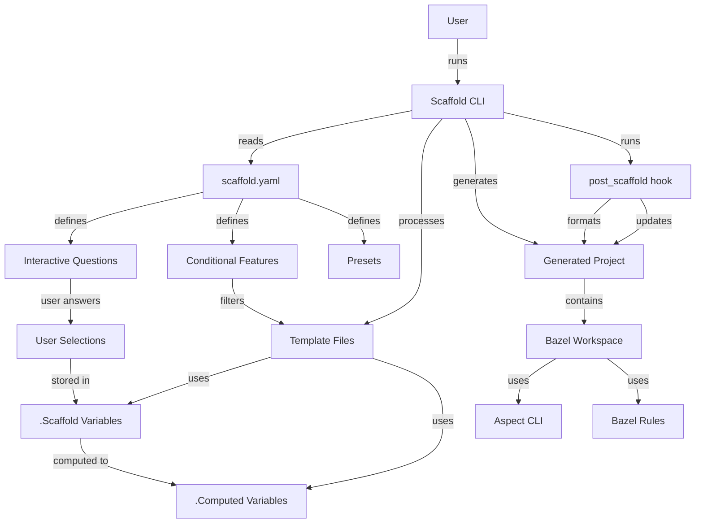

# Contributor Guide

Welcome to the Aspect Workflows Template Contributor Guide! This guide is for developers who want to contribute to improving this template system.

## Table of Contents

1. [Architecture Overview](./architecture.md) - System design and structure
2. [Template System](./template-system.md) - How the templating works
3. [Adding Language Support](./adding-languages.md) - Extend with new languages
4. [Adding Features](./adding-features.md) - Add new capabilities
5. [Testing Changes](./testing.md) - Validate your contributions
6. [Contribution Workflow](./workflow.md) - How to submit changes

## Overview

This template uses [Scaffold](https://hay-kot.github.io/scaffold/) to generate customized Bazel monorepo projects. Understanding the key components will help you make effective contributions.

## Key Concepts

### 1. Template Variables

The template uses Go template syntax with variables defined in `scaffold.yaml`:

- `.ProjectSnake` - The project name in snake_case
- `.Scaffold.*` - User selections (langs, lint, stamp, oci, codegen)
- `.Computed.*` - Derived values (javascript, python, go, java, etc.)

### 2. Conditional Features

Features are conditionally included based on user selections using the `features` section in `scaffold.yaml`. Files are included or excluded based on glob patterns.

### 3. Multi-Language Support

The template supports 8 programming languages, each with:

- Language-specific dependencies in `MODULE.bazel`
- BUILD file generation via Gazelle
- Formatting and linting rules
- Package management tools

### 4. Aspect Workflows Integration

The template leverages:

- Aspect CLI for enhanced Bazel commands
- bazel-env.bzl for development environment management
- rules_lint for code quality
- Multitool for tool version management

## Repository Structure

```bash
aspect-workflows-template/
├── scaffold.yaml            # Template configuration
├── test.sh                  # Template testing script
├── hooks/
│   └── post_scaffold        # Post-generation setup
├── user_stories/            # Example test scenarios
│   ├── kitchen-sink.md      # All features enabled
│   ├── minimal.md           # Minimal configuration
│   └── *.md                 # Language-specific examples
└── {{ .ProjectSnake }}/     # Template source
    ├── MODULE.bazel         # Bazel dependencies (templated)
    ├── BUILD                # Root BUILD file (templated)
    ├── .bazelrc             # Bazel configuration
    ├── README.bazel.md      # Generated docs (templated)
    ├── tools/               # Development tools
    │   ├── BUILD            # Tool definitions (templated)
    │   ├── repin            # Dependency update script
    │   ├── format/          # Formatting setup
    │   ├── lint/            # Linting configuration
    │   └── oci/             # Container building
    └── requirements/        # Python dependencies
```

## Architecture Diagram



## Development Environment

### Prerequisites

- Go 1.21+ (for scaffold)
- Bazel 7.0+ (for testing generated projects)
- direnv (for development environment)
- Git

### Setting Up

1. Clone the repository:

    ```bash
    git clone https://github.com/aspect-build/aspect-workflows-template
    cd aspect-workflows-template
    ```

2. Install dependencies:

    ```bash
    brew install scaffold  # or use go install
    ```

3. Make changes to template files in `{{ .ProjectSnake }}/`

4. Test your changes (see [Testing](./testing.md))

## How the Template System Works

### 1. scaffold.yaml Configuration

The `scaffold.yaml` file defines:

- **Questions**: Interactive prompts for users
- **Features**: Conditional file inclusion rules
- **Computed Values**: Derived from user answers
- **Presets**: Predefined configurations
- **Messages**: Pre/post generation messages

### 2. Template Processing

Files in `{{ .ProjectSnake }}/` are processed:

1. **Variable Substitution**: `{{ .VariableName }}` replaced with values
2. **Conditional Blocks**: `{{ if .Condition }}...{{ end }}`
3. **Iteration**: `{{ range .Items }}...{{ end }}`
4. **Feature Filtering**: Files included/excluded based on features

### 3. Post-Processing

The `hooks/post_scaffold` script runs after generation:

1. Formats Bazel files with buildifier
2. Runs custom formatting tools
3. Updates dependency lock files
4. Initializes npm/pnpm (if JavaScript selected)

## Making Contributions

### Types of Contributions

We welcome:

- 🐛 **Bug Fixes**: Correct issues in generated projects
- ✨ **New Features**: Add capabilities to the template
- 🌐 **Language Support**: Add or improve language support
- 📝 **Documentation**: Improve guides and examples
- 🧪 **Tests**: Add test scenarios and validation
- 🎨 **Quality**: Improve code quality and consistency

### Contribution Process

1. **Fork the repository**
2. **Create a feature branch**: `git checkout -b feature/my-improvement`
3. **Make your changes**
4. **Test thoroughly** using `test.sh`
5. **Update documentation** as needed
6. **Commit with clear messages**
7. **Push and create a Pull Request**

### Code Style

- Follow Go template best practices
- Keep templates readable with proper indentation
- Add comments for complex conditional logic
- Maintain consistency with existing code
- Test all language combinations affected by changes

## Testing Your Changes

Always test your changes with multiple scenarios:

```bash
# Test specific preset
./test.sh kitchen-sink

# Test minimal configuration
./test.sh minimal

# Test language-specific presets
./test.sh py
./test.sh go
./test.sh js
```

See [Testing Guide](./testing.md) for comprehensive testing instructions.

## Getting Help

- **Issues**: Check existing issues on GitHub
- **Discussions**: Use GitHub Discussions for questions
- **Slack**: Join #aspect-build on Bazel Slack
- **Maintainers**: Tag maintainers in your PR

## Code of Conduct

We follow the [Bazel Community Code of Conduct](https://bazel.build/community/code-of-conduct). Please be respectful and constructive in all interactions.

---

**Next**: [Architecture Overview](./architecture.md) | **Up**: [Documentation Home](../README.md)
