# Architecture Overview

This document provides a comprehensive overview of the Aspect Workflows Template architecture, explaining how the components work together to generate production-ready Bazel projects.

## System Architecture

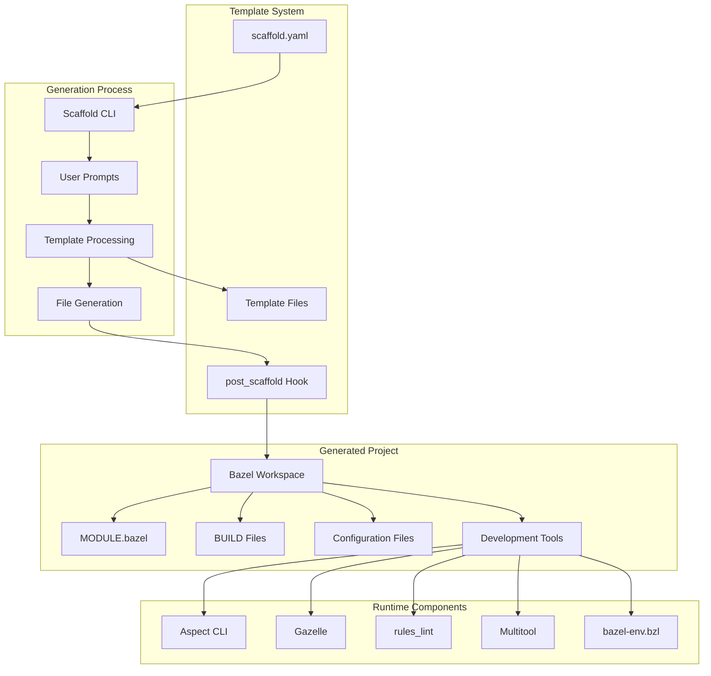

## Core Components

### 1. Template Configuration (scaffold.yaml)

The central configuration file that defines the entire template system.

**Key Sections:**

- **metadata**: Template versioning requirements
- **messages**: Pre/post generation user guidance
- **questions**: Interactive user prompts
- **features**: Conditional file inclusion rules
- **computed**: Derived values from user selections
- **presets**: Predefined configuration sets

**Flow:**

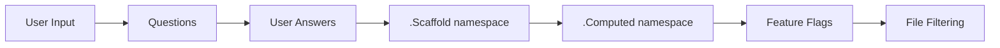

### 2. Template Files ({{ .ProjectSnake }}/)

The source directory containing templated files that will be processed and copied to the generated project.

**Template Syntax:**

```go
// Conditional inclusion
{{ if .Scaffold.lint }}
  // lint-specific code
{{ end }}

// Computed values
{{ if .Computed.javascript }}
  // JavaScript-specific code
{{ end }}

// Variable substitution
bazel_dep(name = "rules_python", version = "{{ .PythonVersion }}")
```

### 3. Post-Processing (hooks/post_scaffold)

A bash script that runs after file generation to:

1. Format generated Bazel files with buildifier
2. Run custom format tools
3. Update dependency lock files (repin)
4. Initialize package managers (pnpm for JavaScript)

### 4. Bazel Module System (MODULE.bazel)

The generated `MODULE.bazel` uses Bazel's bzlmod system for dependency management.

**Dependency Categories:**

- **Core**: bazel_skylib, rules_multitool
- **Language Rules**: rules_python, rules_go, rules_js, etc.
- **Development**: aspect_rules_lint, buildifier_prebuilt
- **Container**: rules_oci (optional)
- **Utilities**: bazel_env.bzl, bazelrc-preset.bzl

**Extension System:**

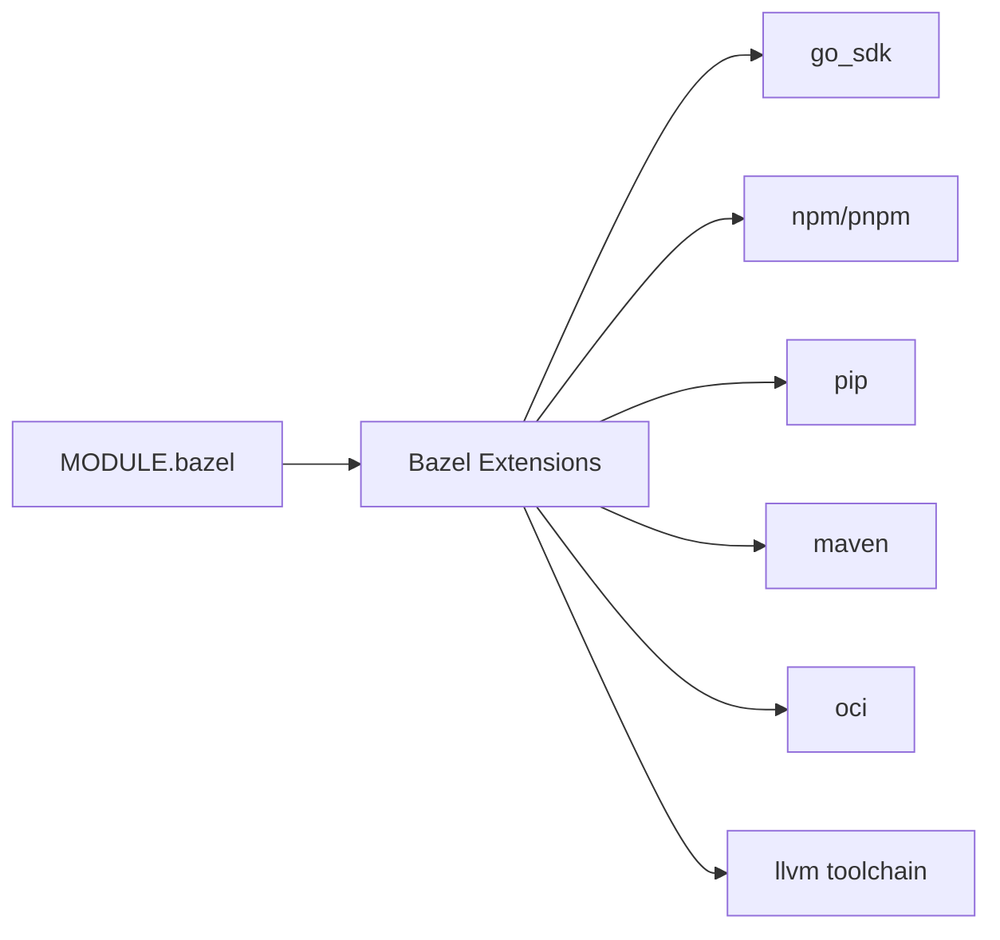

## Language Support Architecture

### Multi-Language Strategy

Each language follows a consistent pattern:

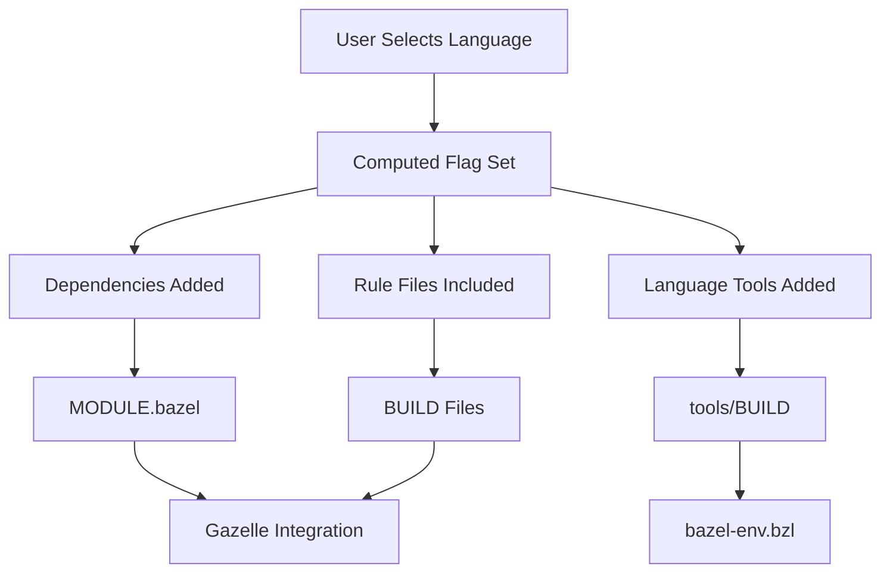

### Language Components

Each language integration includes:

1. **MODULE.bazel entries**: Language rules and toolchains
2. **BUILD file templates**: Language-specific targets
3. **Tool exports**: CLI tools added to PATH via bazel-env
4. **Gazelle support**: Automatic BUILD file generation
5. **Linting rules**: Language-specific linters
6. **Package management**: Dependency resolution

## Development Environment Architecture

### bazel-env.bzl Integration

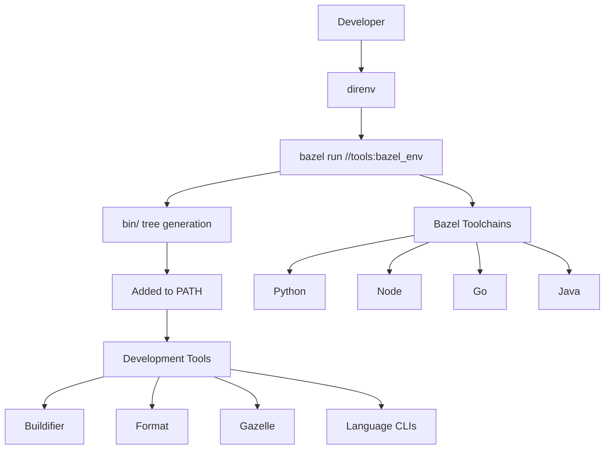

**Benefits:**

- No manual tool installation required
- Version consistency across team
- Hermetic tool execution
- Automatic PATH management via direnv

## Code Quality Architecture

### Formatting and Linting Pipeline

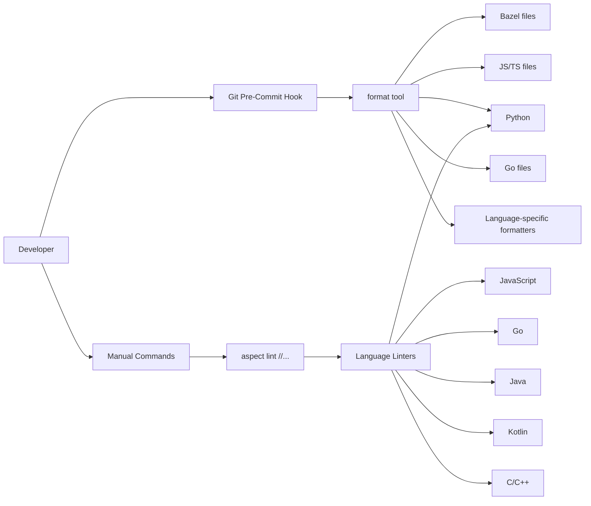

### rules_lint Integration

The template uses [rules_lint](https://github.com/aspect-build/rules_lint) which:

1. Runs linters as Bazel aspects
2. Caches linter results
3. Produces report files
4. Integrates with Aspect CLI for UX

## Dependency Management Architecture

### Python Dependencies

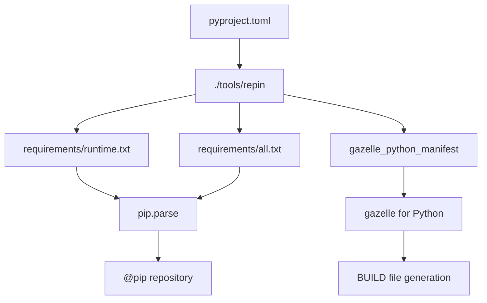

### JavaScript Dependencies

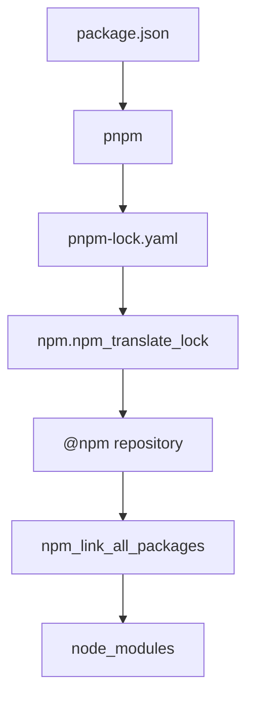

### Go Dependencies

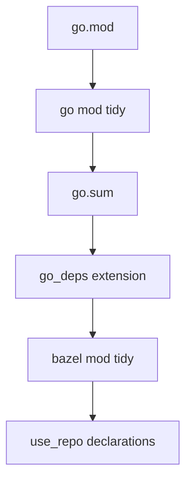

## Build File Generation (Gazelle)

### Gazelle Architecture

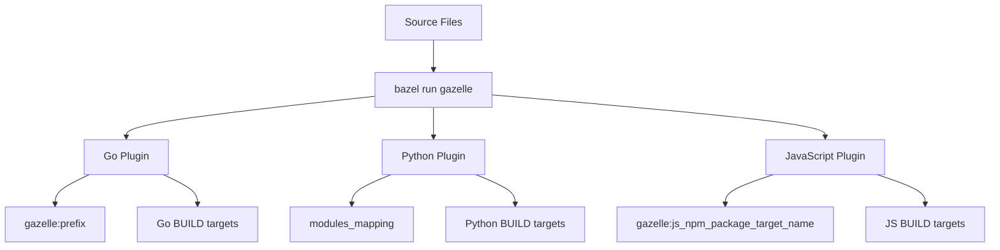

### Configuration

Gazelle is configured via directives in BUILD files:

```python
# gazelle:prefix github.com/example/project
# gazelle:build_file_name BUILD
# gazelle:map_kind py_binary py_binary @aspect_rules_py//py:defs.bzl
# gazelle:exclude **/*.venv
```

## Container Building Architecture (Optional)

### OCI Image Generation

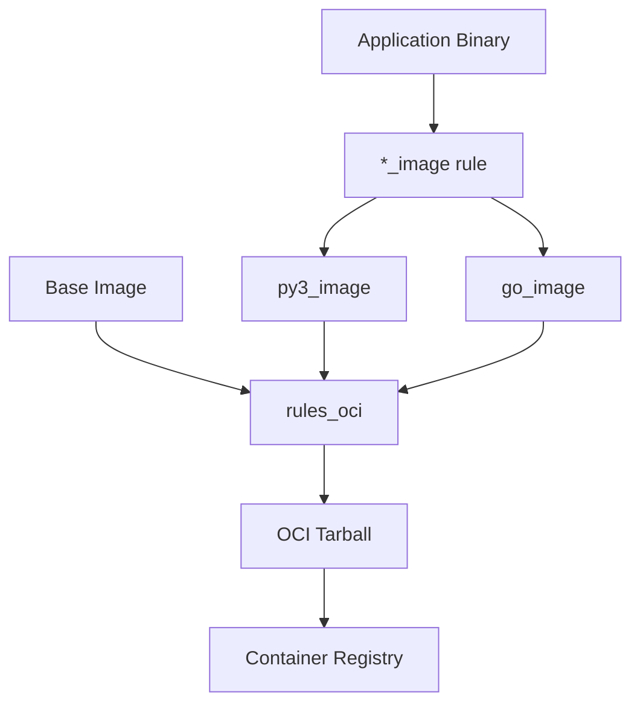

### Image Types

1. **Python Images**: Ubuntu base with Python runtime
2. **Go Images**: Distroless base for minimal images

## Version Stamping Architecture (Optional)

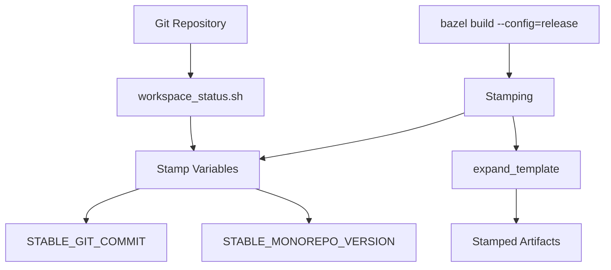

## Extensibility Points

### 1. Custom Rules

Add custom rules in `tools/` directories:

```bash
tools/
├── custom_rule.bzl
└── BUILD
```

### 2. Aspect CLI Extensions

Add custom commands in `.aspect/cli/`:

```bash
.aspect/cli/
├── go_image.star
├── py3_image.star
└── custom_command.star
```

### 3. Linter Configuration

Extend linting in `tools/lint/linters.bzl`:

```python
my_linter = lint_my_linter_aspect(
    binary = Label(":my_linter"),
    configs = [Label("//:.my-linter-config")],
)
```

### 4. Format Tool Integration

Add formatters in `tools/format/BUILD`:

```python
multirun(
    name = "format",
    commands = [
        ":my_formatter",
        # ...
    ],
)
```

## Performance Considerations

### Caching Strategy

- **Remote Caching**: Can be configured in `.bazelrc`
- **Local Cache**: Bazel's built-in caching
- **Action Cache**: Linter results cached as Bazel actions
- **Tool Lockfiles**: Deterministic tool versions

### Scalability

- **Incremental Builds**: Bazel rebuilds only changed targets
- **Parallel Execution**: Multiple actions run concurrently
- **Lazy Loading**: Bzlmod loads only needed dependencies
- **Optimized Toolchains**: Hermetic toolchains reduce setup time

## Security Considerations

- **Hermetic Builds**: All dependencies fetched through Bazel
- **Checksum Verification**: Integrity checks on downloaded artifacts
- **Lockfiles**: Pin exact dependency versions
- **Sandboxing**: Bazel runs actions in sandboxes

---

**Next**: [Template System](./template-system.md) | **Back**: [Contributor Guide](./README.md)
