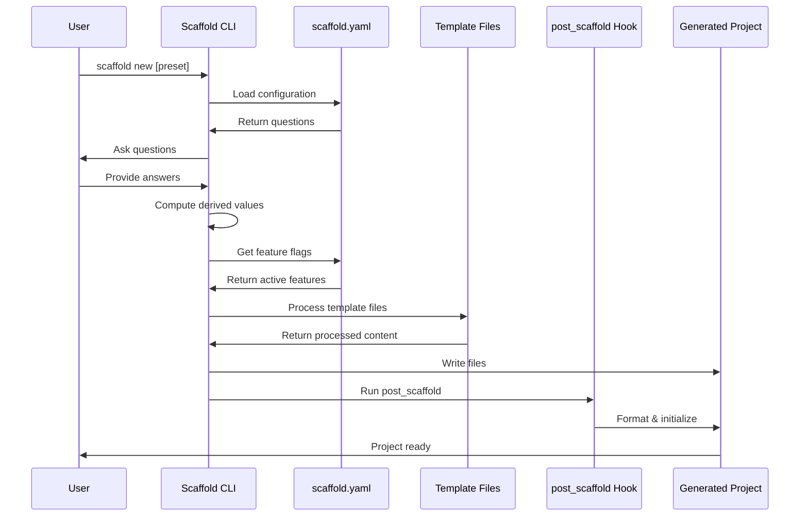

# Template System Deep Dive

This document explains how the Scaffold template system works in detail, enabling you to understand and modify the template generation process.

## Overview

The Aspect Workflows Template uses [Scaffold](https://hay-kot.github.io/scaffold/) as its template engine. Scaffold processes template files using Go's `text/template` syntax and conditionally includes files based on feature flags.

## Template Processing Flow



## scaffold.yaml Structure

### 1. Metadata Section

```yaml
metadata:
  minumum_version: v0.6.1
```

Specifies the minimum Scaffold version required to process this template.

### 2. Messages Section

```yaml
messages:
  pre: |
    # Welcome message shown before questions
  post: |
    # Instructions shown after generation
```

Messages can include template variables:

```yaml
post: |
  cd {{ .ProjectSnake }}
  bazel run //tools:bazel_env
```

### 3. Questions Section

Defines interactive prompts:

```yaml
questions:
  - name: langs              # Variable name
    validate:
      min: 1                 # At least one required
    prompt:
      multi: true            # Multiple selection
      message: Languages to be used in the project
      options:
        - JavaScript & TypeScript
        - Python
        - Go
```

**Question Types:**

- **Multi-select**: `multi: true`
- **Confirmation**: `confirm: true`
- **Text input**: (default)

**Accessing Answers:**

Answers are stored in `.Scaffold.<name>`:

```go
{{ if .Scaffold.lint }}
  // Lint was enabled
{{ end }}
```

### 4. Features Section

Controls which files are included:

```yaml
features:
  - value: "{{ .Scaffold.lint }}"
    globs:
      - "*/tools/format/*"
      - "*/tools/lint/*"
      - "*/githooks/*"
  
  - value: "{{ and .Scaffold.lint .Computed.javascript }}"
    globs:
      - "*/prettier.config.cjs"
      - "*/eslint.config.mjs"
```

**How it works:**

1. Scaffold evaluates the `value` expression
2. If true, files matching `globs` are included
3. If false, files matching `globs` are excluded

**Glob Patterns:**

- `*` - Matches one directory level
- `**` - Matches any number of directory levels
- `*.ext` - Matches files with extension
- `*/dir/*` - Matches files in any `dir` subdirectory

### 5. Computed Section

Derives values from user answers:

```yaml
computed:
  javascript: "{{ has \"JavaScript & TypeScript\" .Scaffold.langs }}"
  python: "{{ has \"Python\" .Scaffold.langs }}"
  go: "{{ has \"Go\" .Scaffold.langs }}"
```

**Template Functions:**

- `has item list` - Returns true if item is in list
- `and expr1 expr2` - Logical AND
- `or expr1 expr2` - Logical OR
- `not expr` - Logical NOT

**Accessing Computed Values:**

```go
{{ if .Computed.javascript }}
  // JavaScript was selected
{{ end }}
```

### 6. Presets Section

Predefined configurations:

```yaml
presets:
  py:
    langs: ['Python']
    codegen: true
    lint: true
  
  kitchen-sink:
    lint: true
    langs: ['Go', 'Python', 'JavaScript & TypeScript']
    codegen: true
    stamp: true
    oci: true
```

**Using Presets:**

```bash
scaffold new --preset=py --no-prompt <url>
```

## Template Syntax

### Variable Substitution

Basic substitution:

```go
Project name: {{ .ProjectSnake }}
```

With fallback:

```go
{{ .CustomVar | default "default_value" }}
```

### Conditional Blocks

Simple condition:

```go
{{ if .Scaffold.lint }}
bazel_dep(name = "aspect_rules_lint", version = "1.9.0")
{{ end }}
```

If-else:

```go
{{ if .Computed.javascript }}
// JavaScript-specific code
{{ else }}
// Alternative code
{{ end }}
```

Complex conditions:

```go
{{ if and .Scaffold.lint .Computed.javascript }}
// Both lint and JavaScript enabled
{{ end }}

{{ if or .Computed.java .Computed.kotlin }}
// Either Java or Kotlin enabled
{{ end }}
```

### Iteration

Loop over list:

```go
{{ range .Scaffold.langs }}
  Language: {{ . }}
{{ end }}
```

With index:

```go
{{ range $i, $lang := .Scaffold.langs }}
  {{ $i }}. {{ $lang }}
{{ end }}
```

### Comments

Template comments (not in output):

```go
{{/* This is a comment */}}
```

### Whitespace Control

Remove leading whitespace:

```go
{{- if .Condition }}
content
{{ end -}}
```

The `-` removes whitespace:

- `{{-` removes whitespace before
- `-}}` removes whitespace after

## Advanced Template Patterns

### Nested Conditions

```go
{{ if .Computed.javascript }}
  {{ if .Scaffold.lint }}
load("@npm//:eslint/package_json.bzl", eslint_bin = "bin")
eslint_bin.eslint_binary(name = "eslint")
  {{ end }}
{{ end }}
```

### Multi-Line Blocks

```starlark
{{ if .Computed.python -}}
bazel_dep(name = "rules_python", version = "1.6.3")
bazel_dep(name = "rules_python_gazelle_plugin", version = "1.6.3")
bazel_dep(name = "aspect_rules_py", version = "1.6.3")
{{- end }}
```

### Combining Multiple Conditions

```go
{{ if and .Scaffold.oci .Computed.python }}
# Python container support
{{ end }}

{{ if and .Scaffold.oci .Computed.go }}
# Go container support
{{ end }}
```

### Optional Sections

```go
{{ if .Scaffold.stamp -}}
bazel_dep(name = "bazel_skylib", version = "1.8.2")
{{- end }}
```

## File Naming Patterns

### Dynamic File Names

Template files can use variables in names:

```go
{{ .ProjectSnake }}/BUILD
{{ .ProjectSnake }}/tools/BUILD
```

The `{{ .ProjectSnake }}` directory is a special convention used by this template.

### Conditional File Inclusion

Instead of conditional names, use the `features` section in scaffold.yaml to include/exclude entire files.

## Testing Template Changes

### 1. Syntax Validation

Check template syntax:

```bash
scaffold validate
```

### 2. Generate Test Project

```bash
./test.sh kitchen-sink
```

This generates a project with all features enabled in a temporary directory.

### 3. Test Specific Preset

```bash
./test.sh py        # Python only
./test.sh go        # Go only
./test.sh minimal   # Minimal config
```

### 4. Manual Testing

```bash
# Generate to specific directory
scaffold new --output-dir=/tmp/test-project --preset=py --no-prompt .

# Test the generated project
cd /tmp/test-project
direnv allow
bazel run //tools:bazel_env
bazel test //...
```

## Common Patterns

### Language Detection Pattern

```yaml
# In scaffold.yaml computed section:
computed:
  javascript: "{{ has \"JavaScript & TypeScript\" .Scaffold.langs }}"
```

```go
// In template files:
{{ if .Computed.javascript }}
// JavaScript-specific configuration
{{ end }}
```

### Feature Combination Pattern

```yaml
# In scaffold.yaml features section:
- value: "{{ and .Scaffold.lint .Computed.javascript }}"
  globs:
    - "*/eslint.config.mjs"
```

### Multi-Language Support Pattern

```go
{{ if or .Computed.java .Computed.kotlin }}
bazel_dep(name = "rules_java", version = "8.16.1")
{{ end }}
```

### Tool Export Pattern

```go
{{ if .Computed.javascript }}
        "node": "$(NODE_PATH)",
        "pnpm": "@pnpm",
{{ end }}
```

## Debugging Templates

### 1. Add Debug Output

Temporarily add debug statements:

```go
{{/* DEBUG: Computed.javascript = {{ .Computed.javascript }} */}}
{{/* DEBUG: Scaffold.lint = {{ .Scaffold.lint }} */}}
```

### 2. Generate with Verbose Output

```bash
SCAFFOLD_DEBUG=1 scaffold new --output-dir=/tmp/test .
```

### 3. Check Generated Files

After generation, verify:

```bash
cd /tmp/test
find . -name "BUILD" -exec cat {} \;
cat MODULE.bazel
```

### 4. Validate BUILD Files

```bash
cd /tmp/test
bazel build //...  # Should succeed
```

## Best Practices

### 1. Keep Templates Readable

Use whitespace control judiciously:

```go
# Good
{{ if .Condition }}
content
{{ end }}

# Too compressed
{{- if .Condition -}}content{{- end -}}
```

### 2. Add Comments

Document complex logic:

```go
{{/* Include Python linting only if both Python and lint are enabled */}}
{{ if and .Computed.python .Scaffold.lint }}
load("@aspect_rules_lint//lint:ruff.bzl", "ruff_aspect")
{{ end }}
```

### 3. Use Consistent Indentation

Match the file type:

```python
# Python-style indentation in .bzl files
{{ if .Condition }}
def my_function():
    pass
{{ end }}
```

### 4. Test All Combinations

When adding features, test:

- Feature enabled alone
- Feature disabled
- Feature combined with others
- All presets that might enable the feature

### 5. Update Features List

When adding new conditional files, update scaffold.yaml features:

```yaml
features:
  - value: "{{ .MyNewFeature }}"
    globs:
      - "*/path/to/new/files/*"
```

## Troubleshooting Template Issues

### Template Syntax Errors

**Error**: `template: ...: function "unknown" not defined`

**Solution**: Check function names. Available functions:

- `has`, `and`, `or`, `not`, `default`

### Variable Not Found

**Error**: `can't evaluate field X in type`

**Solution**: Check variable exists in scaffold.yaml questions or computed sections.

### Files Not Being Included

**Problem**: Files aren't appearing in generated project

**Solution**:

1. Check `features` section in scaffold.yaml
2. Verify glob pattern matches your files
3. Test the value expression evaluates to true

### Post-Processing Failures

**Problem**: post_scaffold hook fails

**Solution**:

1. Check generated files are valid
2. Test commands individually:

   ```bash
   cd generated-project
   bazel run @buildifier_prebuilt//:buildifier -r .
   bazel run //tools/format
   ./tools/repin
   ```

---

**Next**: [Adding Language Support](./adding-languages.md) | **Back**: [Contributor Guide](./README.md)
