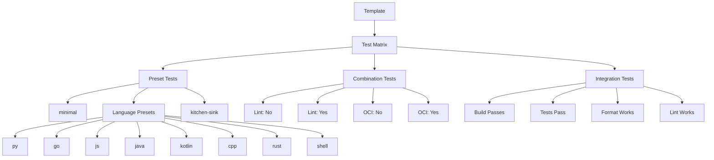
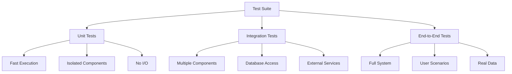
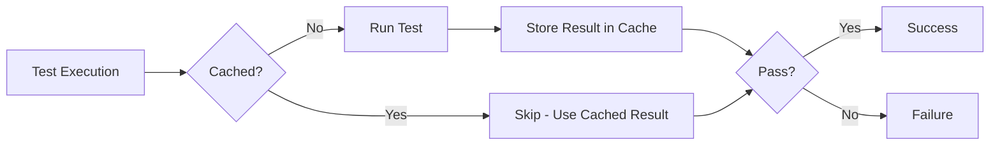

# Testing Guide

This comprehensive guide covers testing strategies and practices for the Aspect Workflows Template, both for testing the template itself and for writing tests in generated projects.

## Testing the Template

### Overview

Testing the template ensures that generated projects work correctly across all language combinations and feature selections.

### Test Script

The `test.sh` script automates template testing:

```bash
#!/usr/bin/env bash
# Usage: ./test.sh [preset]
# Example: ./test.sh kitchen-sink

set -o errexit -o pipefail -o nounset

tmp="$(mktemp -d)" 

if ! SCAFFOLD_SETTINGS_RUN_HOOKS=always scaffold new \
    --output-dir="$tmp" \
    --preset="${1:-kitchen-sink}" \
    --no-prompt \
    $(pwd); then
    rm -rf "$tmp"
    echo "Cleaned up ${tmp}"
    exit 1
fi

echo "Output is at $tmp"

read -rep "Delete it now? (y/n) " answer

if [[ "${answer}" != "n" ]]; then 
    rm -rf "$tmp"
    echo "Cleaned up ${tmp}"
fi
```

### Running Template Tests

```bash
# Test with all features (kitchen-sink)
./test.sh kitchen-sink

# Test minimal configuration
./test.sh minimal

# Test language-specific presets
./test.sh py
./test.sh go
./test.sh js
./test.sh java
./test.sh kotlin
./test.sh cpp
./test.sh rust
./test.sh shell
```

### Test Matrix



### Validation Checklist

For each preset test:

- [ ] Template generates without errors
- [ ] `post_scaffold` hook completes successfully
- [ ] Generated project structure is correct
- [ ] `MODULE.bazel` is valid
- [ ] `BUILD` files are syntactically correct
- [ ] `bazel build //...` succeeds
- [ ] `bazel test //...` succeeds (if tests exist)
- [ ] `format` command works (if lint enabled)
- [ ] `aspect lint //...` works (if lint enabled)
- [ ] Language-specific tools are available

### Automated Template Testing

Create a comprehensive test script:

```bash
#!/usr/bin/env bash
# test-all.sh - Test all template presets

set -o errexit -o nounset -o pipefail

PRESETS=(
    "minimal"
    "py"
    "go"
    "js"
    "java"
    "kotlin"
    "cpp"
    "rust"
    "shell"
    "kitchen-sink"
)

RESULTS_FILE="test-results.txt"
echo "Template Test Results - $(date)" > "$RESULTS_FILE"
echo "========================================" >> "$RESULTS_FILE"

for preset in "${PRESETS[@]}"; do
    echo "Testing preset: $preset"
    tmp=$(mktemp -d)
    
    # Generate project
    if scaffold new \
        --output-dir="$tmp" \
        --preset="$preset" \
        --no-prompt \
        $(pwd) &>/dev/null; then
        
        cd "$tmp"
        
        # Test build
        if bazel build //... &>/dev/null; then
            echo "✅ $preset: BUILD PASSED" | tee -a "$RESULTS_FILE"
        else
            echo "❌ $preset: BUILD FAILED" | tee -a "$RESULTS_FILE"
        fi
        
        # Test if tests exist and run
        if bazel query 'tests(//...)' &>/dev/null; then
            if bazel test //... &>/dev/null; then
                echo "✅ $preset: TESTS PASSED" | tee -a "$RESULTS_FILE"
            else
                echo "❌ $preset: TESTS FAILED" | tee -a "$RESULTS_FILE"
            fi
        fi
        
        cd -
    else
        echo "❌ $preset: GENERATION FAILED" | tee -a "$RESULTS_FILE"
    fi
    
    rm -rf "$tmp"
done

echo "========================================" >> "$RESULTS_FILE"
echo "Test run completed at $(date)" >> "$RESULTS_FILE"
cat "$RESULTS_FILE"
```

## Testing in Generated Projects

### Test Framework Integration

Each language has its test framework integrated:

| Language | Framework | Command |
|----------|-----------|---------|
| Python | pytest | `bazel test //pkg:test` |
| JavaScript/TypeScript | Jest | `bazel test //pkg:test` |
| Go | testing | `bazel test //pkg:test` |
| Java | JUnit | `bazel test //pkg:test` |
| Kotlin | JUnit | `bazel test //pkg:test` |
| C/C++ | Google Test | `bazel test //pkg:test` |
| Rust | built-in | `bazel test //pkg:test` |

### Writing Tests

#### Python Tests (pytest)

```python
# src/calculator_test.py
import pytest
from calculator import add, subtract

def test_add():
    assert add(2, 3) == 5
    assert add(-1, 1) == 0

def test_subtract():
    assert subtract(5, 3) == 2
    assert subtract(0, 5) == -5

@pytest.mark.parametrize("a,b,expected", [
    (1, 2, 3),
    (0, 0, 0),
    (-1, -1, -2),
])
def test_add_parametrized(a, b, expected):
    assert add(a, b) == expected
```

BUILD file:

```python
py_test(
    name = "calculator_test",
    srcs = ["calculator_test.py"],
    deps = [
        ":calculator",
        "@pip//pytest",
    ],
)
```

#### TypeScript Tests (Jest)

```typescript
// src/calculator.test.ts
import { add, subtract } from './calculator';

describe('Calculator', () => {
    describe('add', () => {
        it('should add two positive numbers', () => {
            expect(add(2, 3)).toBe(5);
        });
        
        it('should handle negative numbers', () => {
            expect(add(-1, 1)).toBe(0);
        });
    });
    
    describe('subtract', () => {
        it('should subtract two numbers', () => {
            expect(subtract(5, 3)).toBe(2);
        });
    });
});
```

#### Go Tests

```go
// calculator_test.go
package calculator

import "testing"

func TestAdd(t *testing.T) {
    tests := []struct {
        name     string
        a, b     int
        expected int
    }{
        {"positive numbers", 2, 3, 5},
        {"with zero", 0, 5, 5},
        {"negative numbers", -1, -1, -2},
    }
    
    for _, tt := range tests {
        t.Run(tt.name, func(t *testing.T) {
            result := Add(tt.a, tt.b)
            if result != tt.expected {
                t.Errorf("Add(%d, %d) = %d; want %d", 
                    tt.a, tt.b, result, tt.expected)
            }
        })
    }
}
```

### Test Organization



### Test Structure Best Practices

```bash
src/
├── myapp/
│   ├── BUILD
│   ├── main.py              # Application code
│   ├── main_test.py         # Unit tests
│   ├── lib/
│   │   ├── BUILD
│   │   ├── utils.py
│   │   └── utils_test.py
│   └── integration/
│       ├── BUILD
│       └── api_test.py      # Integration tests
└── e2e/
    ├── BUILD
    └── user_flow_test.py     # End-to-end tests
```

### Test Tags

Use tags to categorize tests:

```python
py_test(
    name = "unit_test",
    srcs = ["unit_test.py"],
    tags = ["unit", "fast"],
)

py_test(
    name = "integration_test",
    srcs = ["integration_test.py"],
    tags = ["integration", "requires-docker"],
)
```

Run tagged tests:

```bash
# Run only unit tests
bazel test --test_tag_filters=unit //...

# Run everything except slow tests
bazel test --test_tag_filters=-slow //...

# Run integration tests
bazel test --test_tag_filters=integration //...
```

### Test Coverage

#### Python Coverage

```bash
# Install coverage plugin
pip install pytest-cov

# Run with coverage
bazel test --test_env=COVERAGE_ENABLED=1 //...

# Or use pytest directly
pytest --cov=src --cov-report=html
```

#### Go Coverage

```bash
# Generate coverage
bazel coverage //...

# View coverage report
genhtml bazel-out/_coverage/_coverage_report.dat -o coverage_html
open coverage_html/index.html
```

### Test Data Management

Store test data alongside tests:

```bash
src/myapp/
├── BUILD
├── main.py
├── main_test.py
└── testdata/
    ├── input.json
    └── expected_output.json
```

Reference in BUILD:

```python
py_test(
    name = "main_test",
    srcs = ["main_test.py"],
    data = glob(["testdata/**"]),
)
```

Access in test:

```python
import os

def test_with_data():
    testdata_dir = os.path.join(os.path.dirname(__file__), "testdata")
    input_file = os.path.join(testdata_dir, "input.json")
    # Use input_file
```

### Mocking and Fixtures

#### Python (pytest fixtures)

```python
# conftest.py
import pytest

@pytest.fixture
def sample_data():
    return {"key": "value"}

@pytest.fixture
def mock_api(mocker):
    return mocker.patch('myapp.api.call_external_service')

# test file
def test_with_fixture(sample_data, mock_api):
    mock_api.return_value = "mocked response"
    # Test code
```

#### Go Mocking

```go
// Use interface for mocking
type Service interface {
    DoSomething() error
}

type MockService struct {
    DoSomethingFunc func() error
}

func (m *MockService) DoSomething() error {
    return m.DoSomethingFunc()
}

// In test
func TestWithMock(t *testing.T) {
    mock := &MockService{
        DoSomethingFunc: func() error {
            return nil
        },
    }
    // Use mock
}
```

### Continuous Testing

#### Watch Mode with ibazel

```bash
# Watch and rerun tests on changes
ibazel test //src/app:app_test

# Watch entire test suite
ibazel test //...
```

#### Pre-Commit Testing

Add to `githooks/pre-commit`:

```bash
#!/usr/bin/env bash
# Run tests before commit

echo "Running tests..."
if ! bazel test //... ; then
    echo "Tests failed. Commit aborted."
    exit 1
fi
```

### Test Performance



### Optimizing Test Speed

```bash
# Run tests in parallel
bazel test --jobs=auto //...

# Skip slow tests during development
bazel test --test_tag_filters=-slow //...

# Use test sharding for large suites
bazel test --test_sharding_strategy=explicit //...

# Cache test results
bazel test --cache_test_results=yes //...

# Don't cache during development
bazel test --cache_test_results=no //...
```

### Debugging Test Failures

```bash
# Show test output
bazel test --test_output=all //src:app_test

# Show only errors
bazel test --test_output=errors //...

# Run test multiple times
bazel test --runs_per_test=100 //src:flaky_test

# Get test logs
bazel test //src:app_test
cat bazel-testlogs/src/app_test/test.log

# Run with verbose Python output
bazel test --test_arg=-v //src:app_test
```

### Integration Testing

Example integration test structure:

```python
# integration_test.py
import pytest
import docker

@pytest.fixture(scope="module")
def database():
    """Start a database container for tests"""
    client = docker.from_env()
    container = client.containers.run(
        "postgres:14",
        environment={"POSTGRES_PASSWORD": "test"},
        ports={'5432/tcp': 5432},
        detach=True
    )
    yield container
    container.stop()
    container.remove()

def test_database_connection(database):
    # Test database operations
    pass
```

BUILD file with docker requirement:

```python
py_test(
    name = "integration_test",
    srcs = ["integration_test.py"],
    tags = ["integration", "requires-docker"],
    deps = [
        "@pip//pytest",
        "@pip//docker",
    ],
)
```

---

**Next**: [Contribution Workflow](./workflow.md) | **Back**: [Contributor Guide](./README.md)
