# Visual Architecture Diagrams

This document contains comprehensive visual diagrams to help understand the Aspect Workflows Template architecture and workflows.

## Table of Contents

1. [Overall System Architecture](#overall-system-architecture)
2. [Template Generation Flow](#template-generation-flow)
3. [Build System Architecture](#build-system-architecture)
4. [Development Workflow](#development-workflow)
5. [Dependency Management](#dependency-management)
6. [Code Quality Pipeline](#code-quality-pipeline)
7. [Multi-Language Integration](#multi-language-integration)
8. [CI/CD Architecture](#cicd-architecture)

## Overall System Architecture

### High-Level Overview

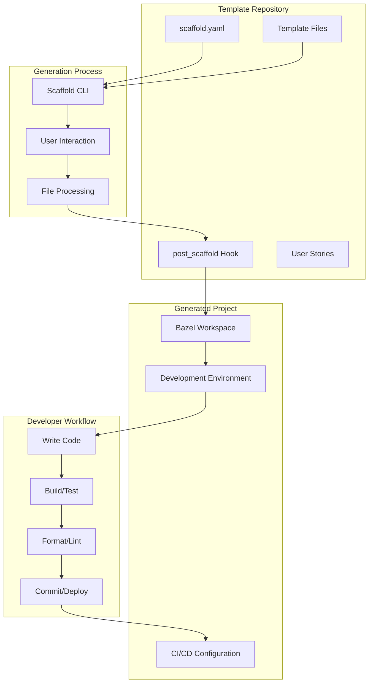

### Component Relationships

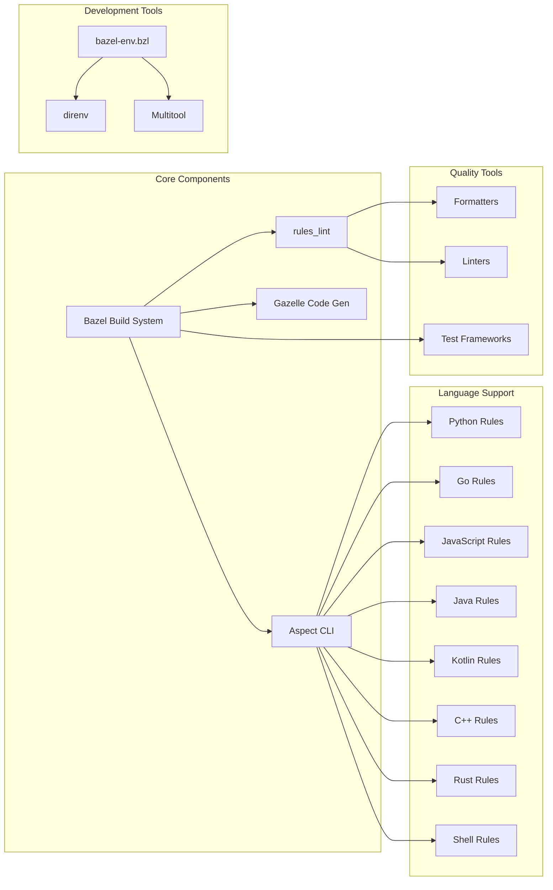

## Template Generation Flow

### Detailed Generation Process

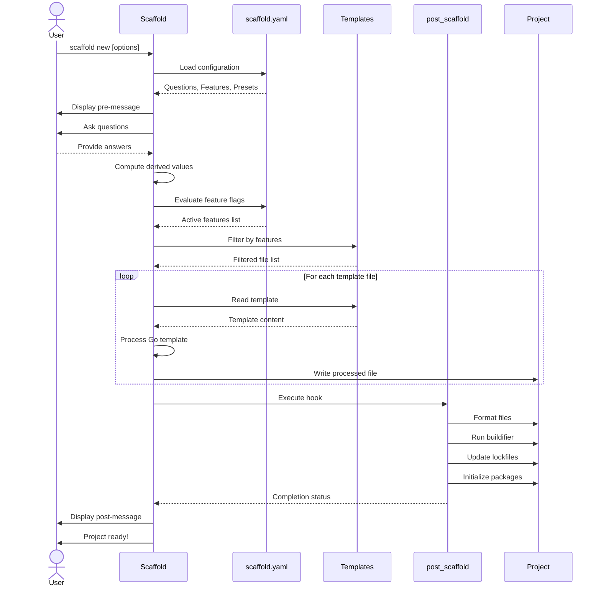

### Feature Flag Resolution

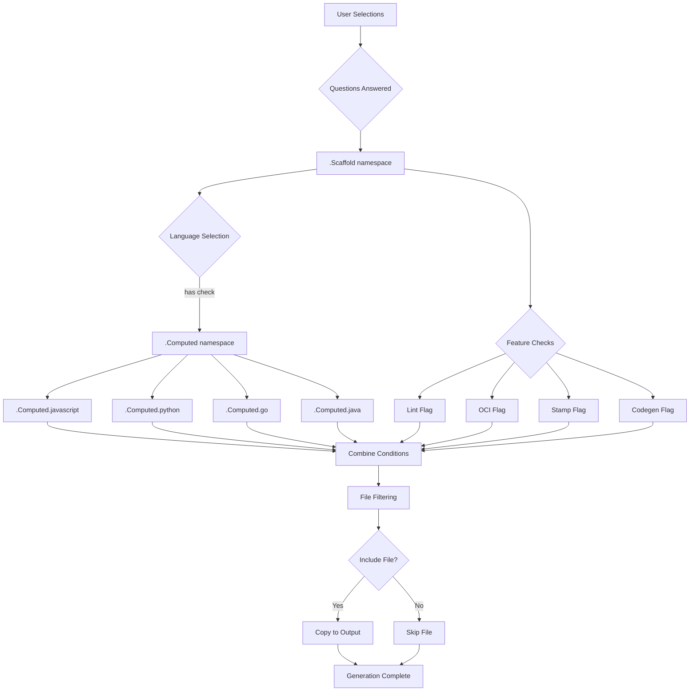

## Build System Architecture

### Bazel Module System (bzlmod)

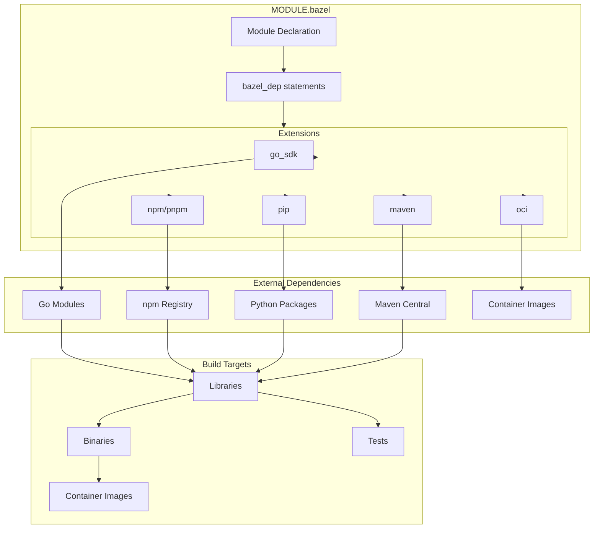

### Build Execution Flow

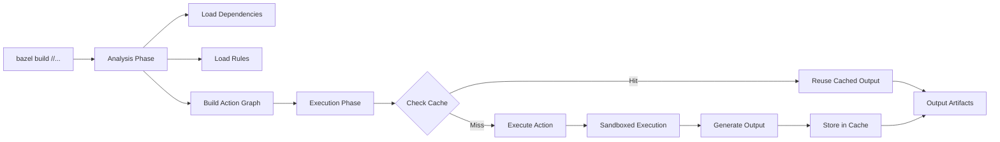

## Development Workflow

### Daily Developer Cycle

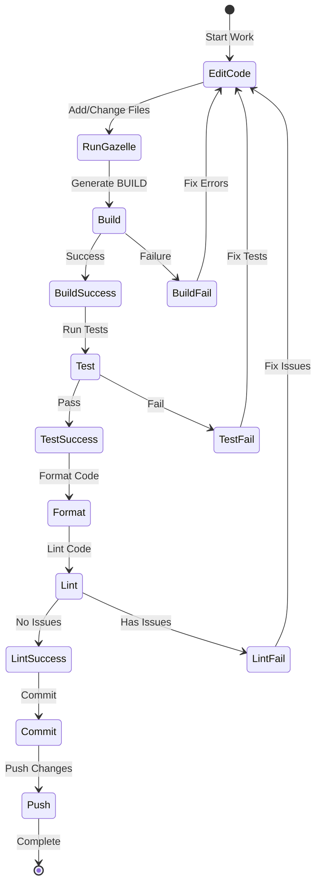

### Development Environment Setup

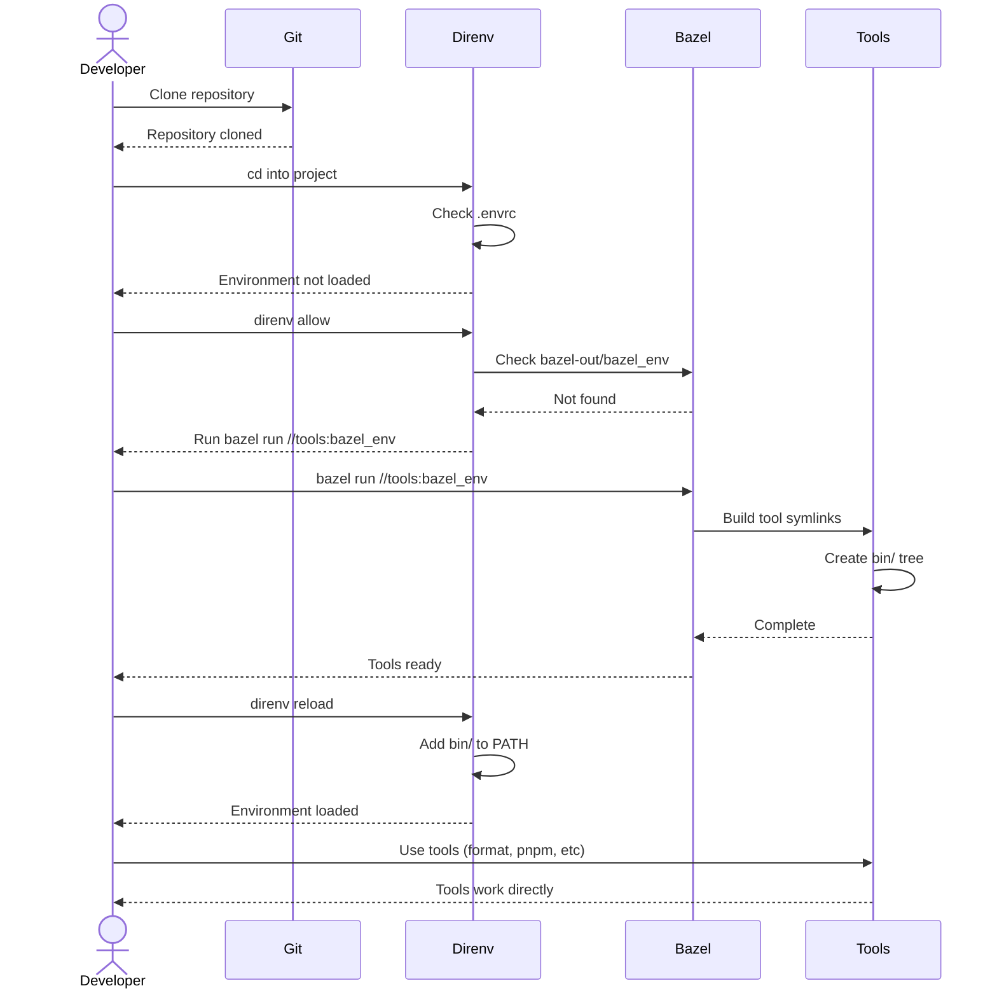

## Dependency Management

### Python Dependency Flow

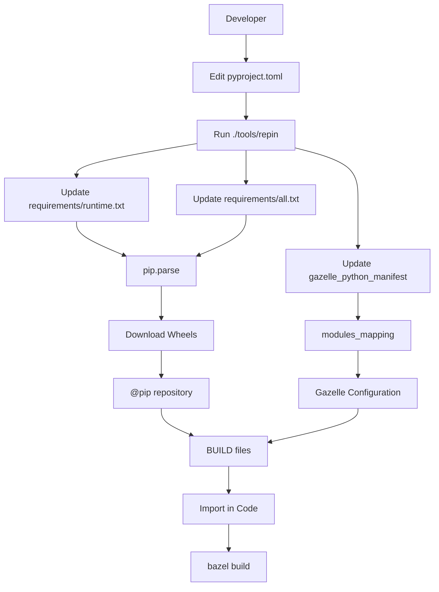

### JavaScript Dependency Flow

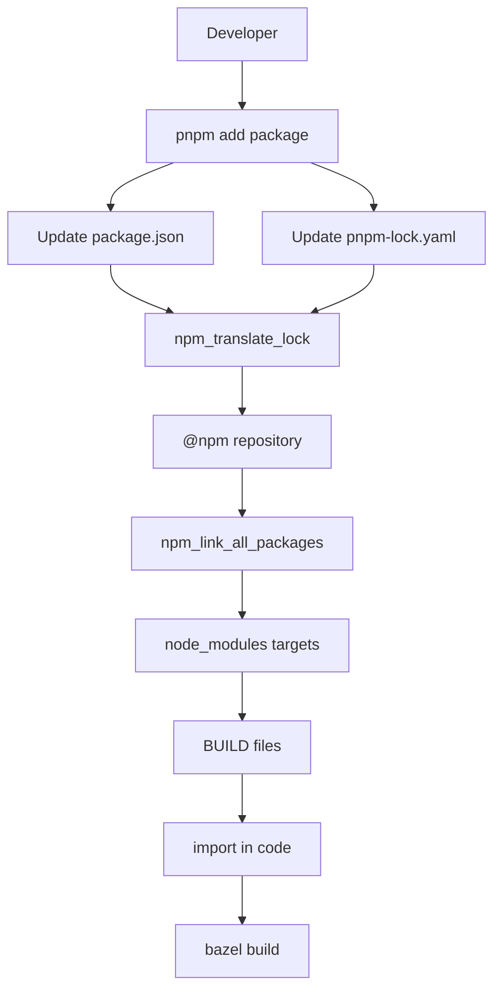

### Go Dependency Flow

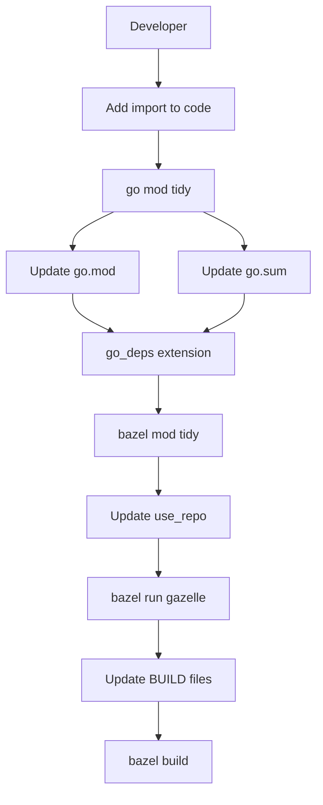

## Code Quality Pipeline

### Format and Lint Workflow

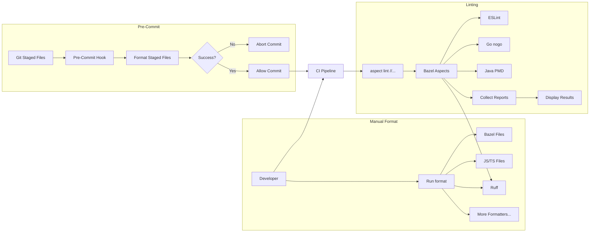

### Linting Architecture

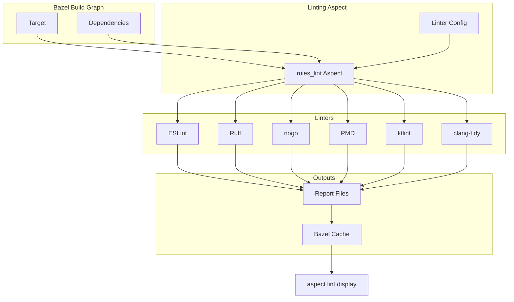

## Multi-Language Integration

### Polyglot Project Structure

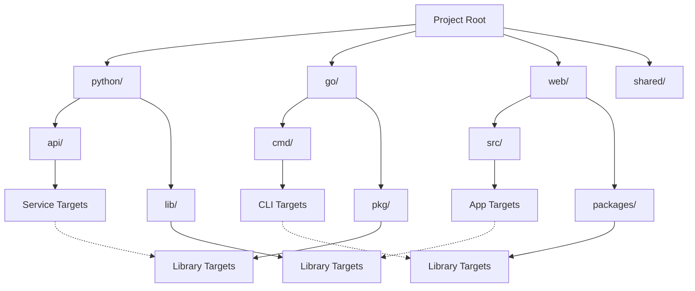

### Cross-Language Dependencies

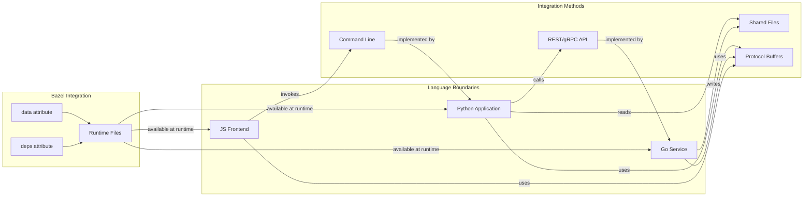

## CI/CD Architecture

### Continuous Integration Pipeline

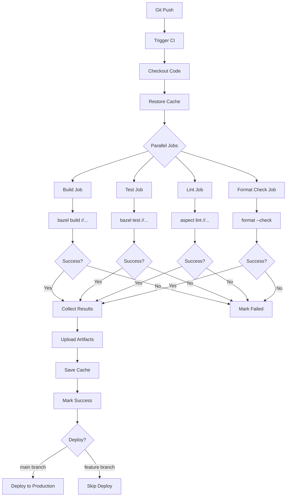

### Remote Cache Integration

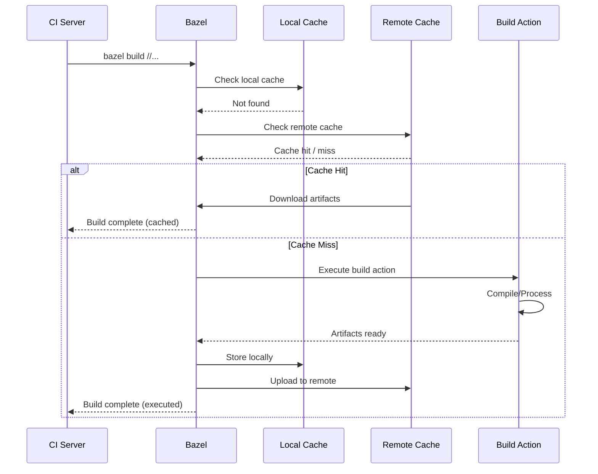

## Summary

These diagrams illustrate:

1. **Overall Architecture**: How components fit together
2. **Generation Flow**: How projects are created from templates
3. **Build System**: How Bazel manages dependencies and builds
4. **Development Workflow**: Daily developer activities
5. **Dependency Management**: How packages are managed per language
6. **Code Quality**: Formatting and linting pipelines
7. **Multi-Language**: How different languages integrate
8. **CI/CD**: Continuous integration and deployment

Use these diagrams as reference when:
- Understanding the system architecture
- Contributing new features
- Debugging issues
- Explaining concepts to team members
- Designing new integrations

---

**Back**: [Documentation Home](./overview.md)
