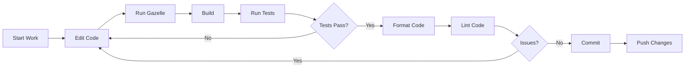

# Development Workflow

This guide covers common day-to-day development tasks when working with projects generated from the Aspect Workflows Template.

## Daily Development Cycle



## Starting Your Day

### 1. Update Your Branch

```bash
# Update main branch
git checkout main
git pull origin main

# Update your feature branch
git checkout feature/my-feature
git merge main
```

### 2. Verify Environment

```bash
# Reload direnv (if needed)
direnv reload

# Verify tools are available
which bazel
which format  # if formatting is enabled

# Update dependencies if needed
bazel sync
```

## Writing Code

### Adding New Files

1. **Create your source files** in the appropriate directory
2. **Run Gazelle** to generate BUILD entries:

   ```bash
   bazel run gazelle
   ```

3. **Verify the BUILD file** was updated correctly
4. **Build to check** for errors:

   ```bash
   bazel build //path/to:target
   ```

### Example: Adding a Python Module

```bash
# Create module
mkdir -p src/mymodule
cat > src/mymodule/calculator.py << 'EOF'
def add(a, b):
    return a + b

def subtract(a, b):
    return a - b
EOF

# Create test
cat > src/mymodule/calculator_test.py << 'EOF'
import pytest
from mymodule.calculator import add, subtract

def test_add():
    assert add(2, 3) == 5

def test_subtract():
    assert subtract(5, 3) == 2
EOF

# Generate BUILD file
bazel run gazelle

# Run tests
aspect test //src/mymodule:all
```

### Example: Adding a TypeScript Module

```bash
# Create module
mkdir -p packages/mylib
cat > packages/mylib/index.ts << 'EOF'
export function greet(name: string): string {
    return `Hello, ${name}!`;
}
EOF

# Create test
cat > packages/mylib/index.test.ts << 'EOF'
import { greet } from './index';

describe('greet', () => {
    it('should greet user', () => {
        expect(greet('World')).toBe('Hello, World!');
    });
});
EOF

# Generate BUILD file (if gazelle configured for JS)
bazel run gazelle

# Or manually create package.json and run build
```

## Building

### Build Commands

```bash
# Build everything
bazel build //...

# Build specific target
bazel build //src/app:main

# Build with optimizations
bazel build -c opt //src/app:main

# Build for specific platform
bazel build --platforms=//tools/platforms:linux_arm64 //...

# Build and show output
bazel build //src/app:main && ls -lh bazel-bin/src/app/main
```

### Build Configurations

Common configurations in `.bazelrc`:

```bash
# Development build (fast, with debug info)
bazel build --config=dev //...

# Release build (optimized, stamped)
bazel build --config=release //...

# Remote cache
bazel build --config=remote //...
```

### Incremental Builds

Bazel automatically does incremental builds:

```bash
# First build (full)
bazel build //...

# Edit one file
vim src/app/main.py

# Second build (only changed targets)
bazel build //...  # Much faster!
```

## Testing

### Running Tests

```bash
# Run all tests
aspect test //...

# Run specific test
aspect test //src/app:app_test

# Run tests with specific tag
bazel test --test_tag_filters=unit //...

# Run tests multiple times
bazel test --runs_per_test=10 //src/app:app_test

# Run failed tests only
bazel test --test_output=errors //...
```

### Test Output

```bash
# Show all test output
bazel test --test_output=all //src/app:app_test

# Show only failures
bazel test --test_output=errors //...

# Stream test output in real-time
bazel test --test_output=streamed //src/app:app_test
```

### Debugging Tests

```bash
# Run test with debug output
bazel test --test_output=all --test_arg=-v //src/app:app_test

# Get test logs location
bazel test //src/app:app_test
# Then check: bazel-testlogs/src/app/app_test/test.log

# Run test without caching
bazel test --cache_test_results=no //src/app:app_test
```

## Formatting Code

### Automatic Formatting

```bash
# Format all files
format

# Format specific files
format src/app/main.py src/lib/utils.py

# Format git staged files (in pre-commit hook)
git diff --cached --name-only --diff-filter=AM | xargs format
```

### Manual Formatting

If not using the integrated formatter:

```bash
# Format Bazel files
bazel run @buildifier_prebuilt//:buildifier -- -r .

# Format Python (uses Ruff)
bazel run //tools/format -- src/

# Format JavaScript (if prettier is installed)
bazel run //tools/format:prettier -- packages/
```

## Linting Code

### Running Linters

```bash
# Lint everything
aspect lint //...

# Lint specific package
aspect lint //src/app:all

# Lint with fixes applied
aspect lint --fix //...
```

### Understanding Lint Results

```shell
Lint results for //src/app:main:

src/app/main.py:10:5: E501 line too long (88 > 79 characters)
src/app/main.py:15:1: W293 blank line contains whitespace

Summary:
* errors: 1
* warnings: 1
```

### Configuring Linters

Linter configurations are in the project root:

- **Python**: `pyproject.toml` or `.ruff.toml`
- **JavaScript**: `eslint.config.mjs`
- **Go**: Uses built-in `go vet` and `staticcheck`
- **Java**: `pmd.xml`
- **Kotlin**: `ktlint-baseline.xml` and `.editorconfig`
- **C/C++**: `.clang-tidy`

## Managing Dependencies

### Python Dependencies

```bash
# Add dependency to pyproject.toml
vim pyproject.toml

# Update lockfiles
./tools/repin

# Update BUILD files with new imports
bazel run gazelle
```

### JavaScript Dependencies

```bash
# Add dependency
pnpm add lodash

# Add dev dependency
pnpm add -D typescript

# Update lockfile (automatic with pnpm add)
# Update Bazel (automatic)
```

### Go Dependencies

```bash
# Add import to code
vim src/main.go

# Update go.mod
go mod tidy

# Update MODULE.bazel
bazel mod tidy

# Update BUILD files
bazel run gazelle
```

### Java Dependencies

```bash
# Add to MODULE.bazel maven.install artifacts
vim MODULE.bazel

# Repin
bazel run @unpinned_maven//:pin

# Use in BUILD file
# deps = ["@maven//:com_google_guava_guava"],
```

## Working with Containers (if enabled)

### Building Container Images

```bash
# Build image tarball
bazel build //src/app:image

# View image layers
tar -tzf bazel-bin/src/app/image/tarball.tar

# Load into Docker
bazel run //src/app:image.load

# Verify loaded
docker images | grep app
```

### Pushing to Registry

```bash
# Configure registry in .bazelrc
echo 'build --@rules_oci//oci:registry=docker.io/myorg' >> .bazelrc

# Push image
bazel run //src/app:image.push
```

### Multi-Architecture Builds

```bash
# Build for multiple platforms
bazel build \
  --platforms=//tools/platforms:linux_amd64 \
  --platforms=//tools/platforms:linux_arm64 \
  //src/app:image
```

## Watch Mode Development

Use `ibazel` for automatic rebuilds on file changes:

```bash
# Watch and rebuild
ibazel build //src/app:all

# Watch and rerun tests
ibazel test //src/app:app_test

# Watch and rerun application
ibazel run //src/app:main
```

## Debugging

### Debugging Build Issues

```bash
# Verbose build output
bazel build -s //src/app:main

# Show command lines
bazel build --subcommands //src/app:main

# Explain why target was rebuilt
bazel build --explain=explain.txt //src/app:main
cat explain.txt

# Check dependency graph
bazel query --output graph //src/app:main | dot -Tpng > graph.png
```

### Debugging with IDE

Most IDEs can debug Bazel binaries:

**VSCode:**

```json
{
  "type": "python",
  "request": "launch",
  "program": "${workspaceFolder}/bazel-bin/src/app/main",
  "cwd": "${workspaceFolder}"
}
```

**IntelliJ:**
Use the Bazel plugin and set up run configurations.

## Committing Changes

### Pre-Commit Checklist

- [ ] Build passes: `bazel build //...`
- [ ] Tests pass: `aspect test //...`
- [ ] Code is formatted: `format`
- [ ] No lint errors: `aspect lint //...`
- [ ] Dependencies updated: `./tools/repin` (if needed)
- [ ] BUILD files updated: `bazel run gazelle`

### Using Git Hooks

Enable pre-commit formatting:

```bash
git config core.hooksPath githooks
```

Now formatting runs automatically before each commit.

### Commit Message Format

Use conventional commits:

```
feat: add user authentication module
fix: resolve memory leak in data processor
docs: update README with new examples
test: add integration tests for API
refactor: simplify database query logic
```

## Code Review Workflow

### Before Requesting Review

```bash
# Ensure your branch is up to date
git fetch origin
git merge origin/main

# Run full test suite
aspect test //...

# Check for lint issues
aspect lint //...

# Build everything
bazel build //...
```

### During Review

```bash
# Address review comments
vim src/app/main.py

# Regenerate BUILD files
bazel run gazelle

# Test changes
aspect test //src/app:all

# Commit fixes
git add .
git commit -m "fix: address review comments"
```

## Performance Tips

### Build Performance

```bash
# Use build without tests
bazel build //...

# Limit test execution
bazel test --test_tag_filters=unit //...

# Use local resources efficiently
bazel build --jobs=auto --local_ram_resources=HOST_RAM*.8
```

### Cache Optimization

```bash
# Check cache statistics
bazel info

# Clear cache if corrupted
bazel clean

# Use remote cache
bazel build --remote_cache=https://cache.example.com //...
```

### IDE Performance

```bash
# Generate compile commands for C/C++
bazel run @hedron_compile_commands//:refresh_all

# Generate IntelliJ project
bazel run @rules_intellij//intellij:project
```

## Getting Unstuck

### Common Issues

1. **"Target not found"**: Run `bazel run gazelle`
2. **"Permission denied"**: Check file permissions, may need `chmod +x`
3. **"Module not found"**: Run `./tools/repin` (Python) or `bazel mod tidy` (Go)
4. **"Cache issues"**: Try `bazel clean`
5. **"direnv not working"**: Run `direnv allow` and `bazel run //tools:bazel_env`

### Getting Help

```bash
# Check Bazel help
bazel help build

# Check Aspect CLI help
aspect help lint

# Check tool documentation
pnpm help
go help mod
```

---

**Next**: [Building and Testing](./building-testing.md) | **Back**: [User Guide](./README.md)
